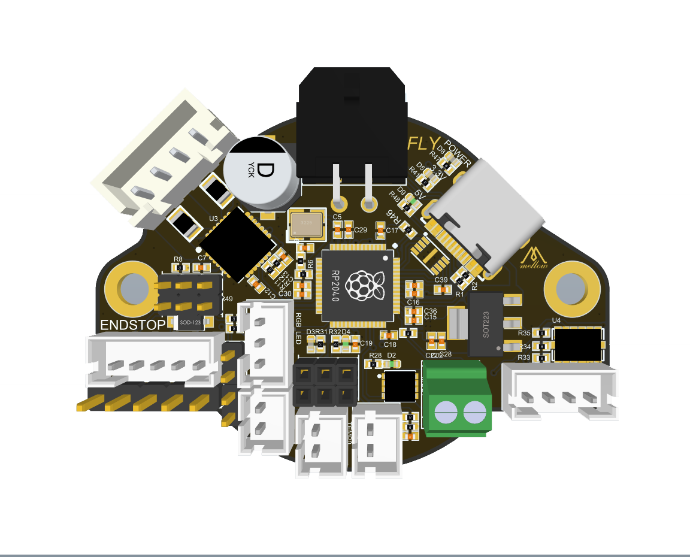

# 配置信息

?> FLY-RHT36与RHT42除了外形不同外，接口配置完全一致

* **全新的Klipper工具头板**

* MCU: RPI RP2040
* 通信: USB
* 驱动: TMC2209*1
* 体积压缩到极致，RHT36甚至采用了6层板设计
* 板载一个TMC2209驱动，可用于挤出机
* 支持PT100(MAX31865)
* 接口：可控风扇*2，RGB*2，限位*2，Probe*1，Servo*1，加热管*1，热敏*1，PT100*1

## RHT-36

## RHT-42

* 敬请期待