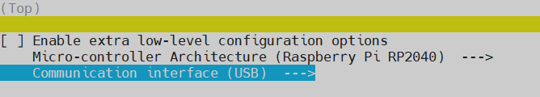
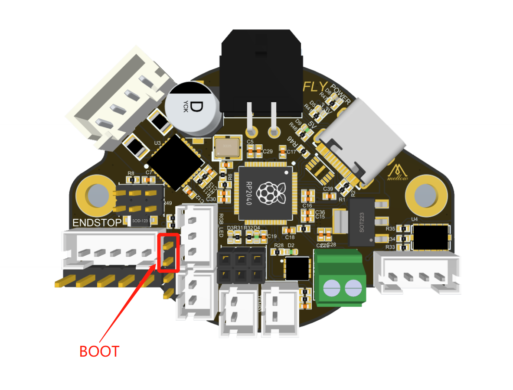
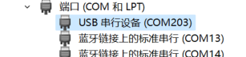
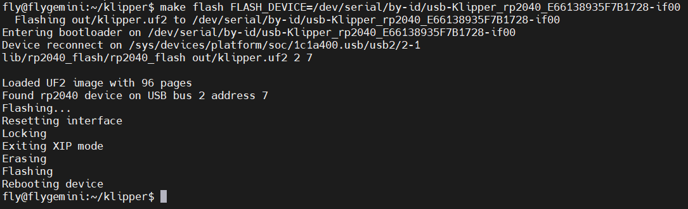
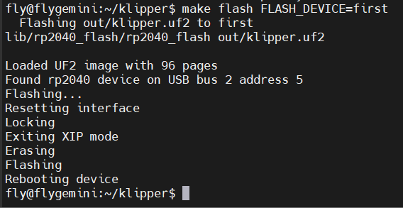

# 固件烧录

## 编译固件

RHT36 & RHT42的Klipper固件配置



* 如何编译固件参考[固件烧录](/introduction/firmware)

## 烧录固件

### USB烧录模式

?> RHT板可按照下图插入跳线帽来进入烧录模式

* 进入RHT36,RHT42的USB烧录模式




### 方式一：Windows系统下烧录

1. RHT板插入BOOT跳线帽
2. 使用USB Type-c数据线连接RHT板到电脑
3. 如果一切正常，电脑中会出现一个可移动磁盘 RPI-RP2
   


4. 将前面编译生成的固件文件(klipper.uf2)复制到RPI-RP2磁盘
5. 如无异常RHT板会自动烧录并重启，此时在电脑设备管理器中应该可以看到一个新的串行端口



6. 出现上图中就是烧录成功


### 方式二：Klipper上位机烧录

1. 如果你的RHT板此前已经烧录过klipper usb固件可直接通过下面的命令来烧录，无需连接BOOT跳线帽
2. 如果你的RHT板此前没有烧录过klipper usb固件请从第3步开始阅读文档

* 注意：下面命令中的FLASH_DEVICE需要根据你的实际情况修改
* 也可输入```make flash FLASH_DEVICE=/dev/serial/by-id/usb-Klipper_rp2040_```后不要按回车，先按Tab键尝试自动补全

```bash
cd ~/klipper
make flash FLASH_DEVICE=/dev/serial/by-id/usb-Klipper_rp2040_12345-if00
```



* 出现上图内容则烧录成功

3. 使用Type-C数据线将RHT板连接到Klipper上位机，请确保连接前已安装boot跳线帽
4. 执行下面的命令查看是否连接成功,如果出现**Raspberry Pi RP2 Boot**则连接，反之亦然

```bash
lsusb | grep 2e8a:0003
```

5. 执行下面命令直接烧录

```bash
cd ~/klipper
make flash FLASH_DEVICE=first
```

* 如果上面的命令无法烧录，出现报错。请使用下面的命令

```bash
cd ~/klipper
sudo make flash FLASH_DEVICE=1d50:614e
```
 


1. 出现上图内容则烧录成功

?> 注意：烧录成功后一定记得拔下来跳线帽