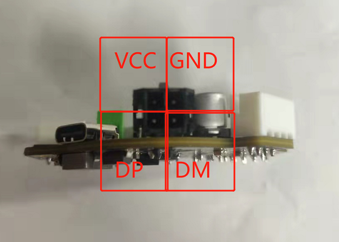
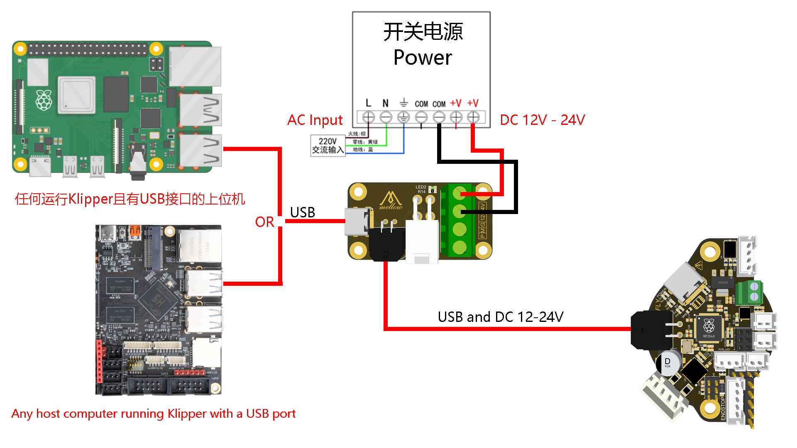
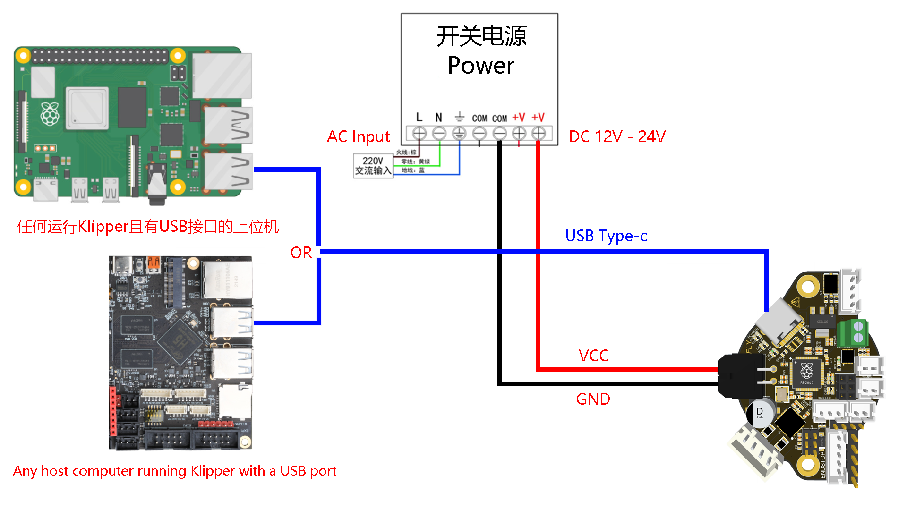
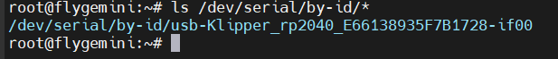
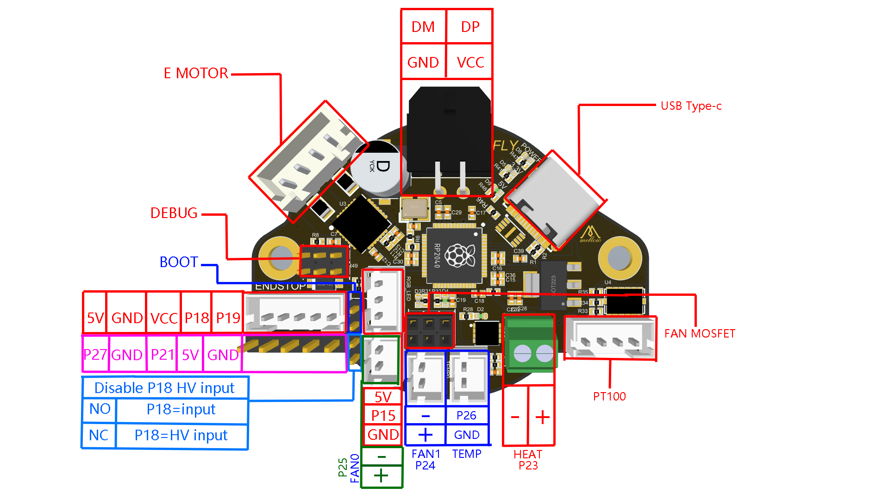

# RHT36/42使用教程

* 使用之前请确保已完成[固件烧录](/board/fly_rht36_42/flash.md)

## 连接到上位机

?> USB中DP(D+)与DM(D-)两根线建议单独使用2芯双绞屏蔽线，0.2平方或更高。

?> Type-c接口只能传输数据和5V供电，不支持PD

?> Type-c接口只能传输数据和5V供电，不支持PD

?> Type-c接口只能传输数据和5V供电，不支持PD

> 正常使用中必须通过MX3.0端口为RHT提供12-24v直流电源

* 接线的两种方式

<!-- tabs:start -->

#### **方法一**

* 通过附赠的USB接线板来连接

* 使用压线钳制作线材，RHT板附赠了端子
* 连接方式如图
  




#### **方法二**

* 使用type-c线连接USB通信，MX3.0端口只接VCC与GND到电源




<!-- tabs:end -->

## 配置

1. 如果没有烧录固件请查看[固件烧录](/board/fly_rht36_42/flash.md)
2. 如果是FLY-Gemini主板可直接打开`http://ip:9999`或者[打开FLY-Tools](http://flygemini.lan:9999/)
3. 树莓派等其他设备

* 进入SSH终端执行下面的命令

```bash
ls /dev/serial/by-id/*
```



* 复制**\/dev\/serial\/by-id\/usb-Klipper_rp2040_E66138935F7B1728-if00** 并将其填写到**printer.cfg**中

4. 具体配置请参考[示例配置](/board/fly_rht36_42/cfg.md)

## 接线图

