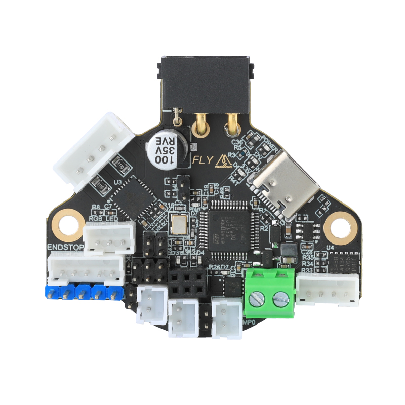

# 1. 产品简介

FLY-RRF36是广州镁伦电子科技有限公司针对3D打印机挤出头设计的喷头工具板，使用该工具板，可以用四根线来替代原来主板与打印头之间繁杂的接线，优化布局。FLY-RRF36适用于36步进电机，其集成了CAN收发器、USB口、TMC5160驱动/TMC2209驱动、ADXL345加速度传感器，两个可控风扇等其他功能的工具板。此工具板适用于Klipper固件。

* 体积压缩极致，采用6层板设计
* 支持CAN总线连接，数据传输更稳定，延迟更小，连接更稳定
* 板载TMC2209驱动可用于挤出机
* 板载ADXL345加速度传感器
* 支持PT100（MAX31865）
* 可更换风扇MOS设计，最大输出电流可达1A
* 支持BLTOUCH、PL08N等调平传感器，集成XY限位开关
* 支持12-24V电压、15A电流输入 

## 1.1 产品详情

淘宝：[FLY 新版3D打印机 Can SHT36 V2.0工具头板DIY KlIpper快接拓展-淘宝网 (taobao.com)](https://item.taobao.com/item.htm?spm=a1z10.5-c-s.w4002-23066022675.38.68de3903lHTcFZ&id=681471830368 "点击即可跳转")

## 1.2 新增功能

* MCU：Raspberry Pi rp2040，Dual core ARM Cortex-M0+@133MHz
* 支持磁编码器(as5047d)，Klipper用于运动分析（目前Klipper暂不支持）
* 增加支持4.7K电阻(用于ntc热敏)或1.1K电阻(用于PT1000)切换
* can接口不再用MX3.0端子，新的连接器支持15A电流，峰值30A
* 增加5/12/24V风扇电压可选。
* 增加板载NTC100k电阻，用于测仓温
* 增加一个电源反接保护
* 增加ADXL345的INT1接到mcu，给个别用户用于调平。
* 增大加热棒端口，额定电流10A
* 增加高压输入限位
* 更换主控为PR2040
* 新增1米CAN连接线，避免用户无法正确压端子导致信号丢失的困扰
* 安装尺寸：孔间距43.84mm，M3安装孔径

----

> [!TIP]
> 重要

* 非FLY上位机请按 [配置上位机](/board/fly_sht_v2/piconfig "点击即可跳转") 文档配置好上位机
* 使用CanBoot请查看 [CanBoot使用](/advanced/canboot.md "点击即可跳转")

----

## 1.3 FLY-RRF36

