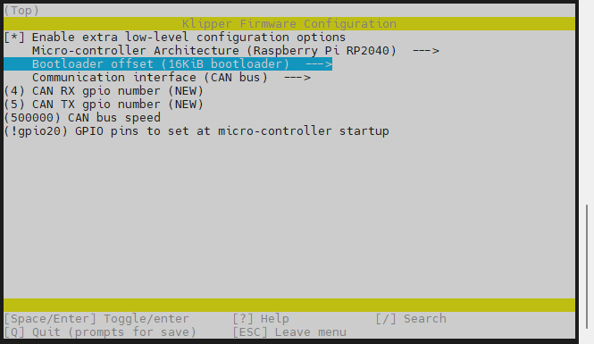
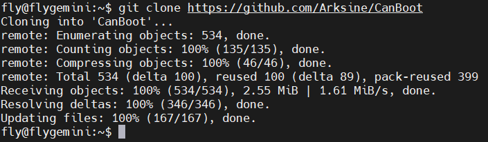
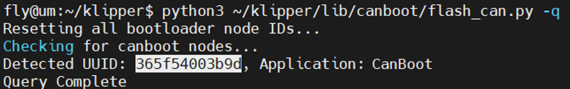
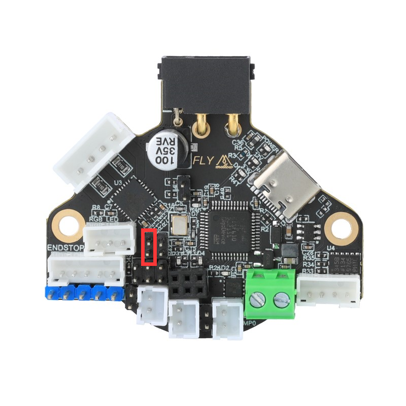
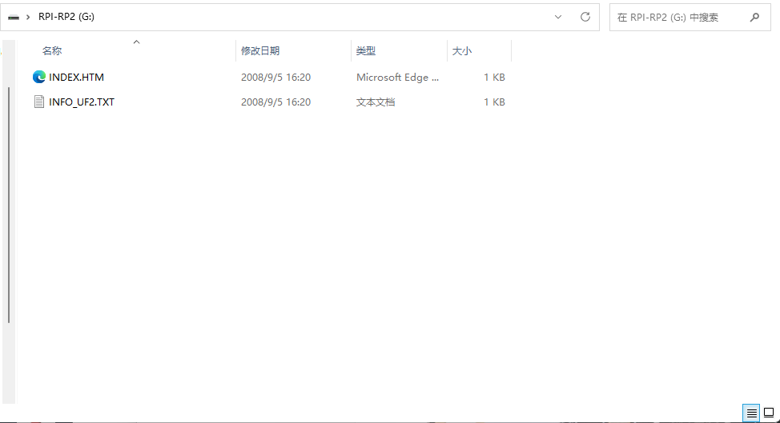

# 4. 固件烧录

?> RRF36预装了CanBoot，支持CAN烧录，烧录前请使用CAN连接到上位机；也可以使用Type-C数据线连到到上位机，使用USB烧录

## 4.1 编译固件

编译固件前请确保 [连接到SSH](/board/fly_pi/FLY_π_description5 "点击即可跳转")

这里只简要介绍固件编译参数，详细固件编译步骤请查看：[编译klipper固件](/board/fly_super8/firmware?id=_1-编译klipper固件 "点击即可跳转")。 看到第 **13** 步即可！！！

1. 确保使用最新的klipper

    ```bash
    # 进入klipper目录并拉取最新的klipper
    cd ~/klipper && git pull
    ```

2. 修改klipper编译配置

    ```bash
    make menuconfig
    ```

    配置如下图

    <!-- tabs:start -->

    

    ### **RRF36-使用CANBOOT烧录**

    **感叹号是英文否则会编译错误**

    **使用CANBOOT烧录时编译此固件**

    
    
    ### **RRF36-使用USB烧录**
    
    **感叹号是英文否则会编译错误**
    
    **使用USB烧录时编译此固件**
    
    
    
    <!-- tabs:end -->
3. 编译

    ```bash
    make -j4
    ```

     最后出现**Creating hex file out/klipper.bin**则编译成功

## 4.2 查找uuid

?> 请使用UTOC或者其他支持klipper USB桥接CAN的主板将FLY-RRF36与上位机通过CAN总线连接

?> 如果已经烧录过klipper并且在正常运行，可跳过查找uuid，使用配置文件中的uuid进行烧录

> 由于FLY-RRF36预装了CanBoot，支持CAN烧录，因此在固件烧录前需要读取uuid后才能烧录固件

首先进入ssh，然后依次输入以下指令

```
git clone https://github.com/Arksine/CanBoot
```



```
cd CanBoot
```

```bash
python3 ~/klipper/lib/canboot/flash_can.py -q
```

下图中高亮部分``365f54003b9d``就是这块FLY-SHT36-PRO板的uuid，这个uuid每块板子都不一样。同一块FLY-SHT36-PRO板烧录固件后uuid是不会变的



?>如果找不到CAN ID，请检查：

* 接线是否正确，例如CANH 和 CANL是否接反或者接触不良
* FLY-RRF36板上的120Ω跳线帽是否插上
* 您的镜像内核是否支持CAN

如果确认没有上述问题，则可以使用使用上位机的USB来烧录固件。

## 4.3 烧录固件

将下面命令中的``365f54003b9d``替换为[查找uuid](#_2-查找uuid "点击即可跳转")中查找到的uuid

```bash
python3 ~/klipper/lib/canboot/flash_can.py -u 365f54003b9d
```

如下图，出现``CAN Flash Success``则烧录成功


## 4.4 使用Type-C烧录固件



**短接跳线插上type-c到电脑会弹出RPI-RP2**

**弹出RPI-RP2后不需要在短接rst**



**把klipper.uf2放进去，弹窗会关闭**
