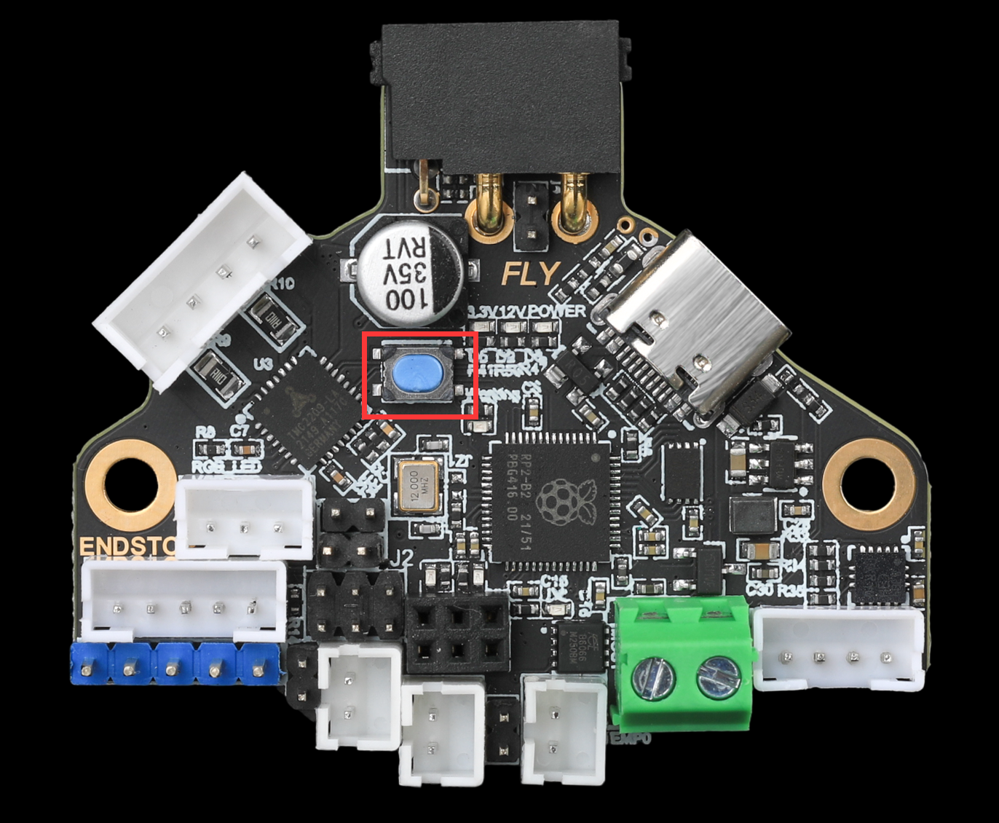

# 3. 固件烧录

?> RRF36预装了RRF固件，支持CAN连接，烧录前请使用USB连接到上位机，使用USB烧录

## 3.1 固件下载

GITHUD:

## 3.2 使用Type-C烧录固件

**短接跳线插上type-c到电脑会弹出RPI-RP2**

**弹出RPI-RP2后不需要在短接rst**

**把klipper.uf2放进去，弹窗会关闭**

?>**刷完固件，led会闪烁**

