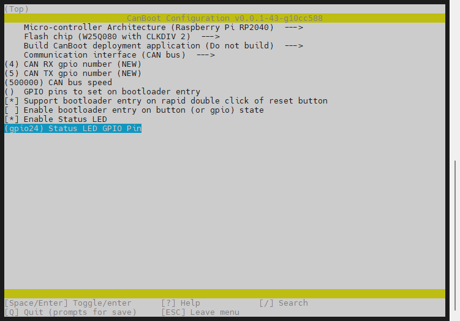
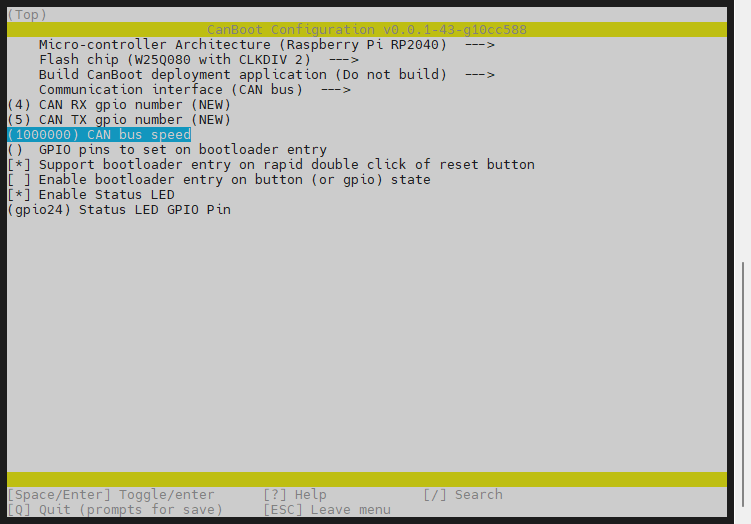

# 编译固件

编译固件前请确保 [连接到SSH](/board/fly_pi/FLY_π_description5 "点击即可跳转")

这里只简要介绍固件编译参数

> [!TIP]
> 固件配置方法只是参考，需要按主板提供配置来配置

**固件配置方法**


1. 进入CanBoot

    ```bash
    cd ~/CanBoot
    ```
    
2. 修改Canboot编译配置

    ```bash
    make menuconfig
    ```

# 固件编译

<!-- tabs:start -->


### **500k**




### **1M**



<!-- tabs:end -->

3. 编译

    ```bash
    make -j4
    ```

     最后出现**Creating bin file out/canboot.bin**则编译成功
    
    

# 烧录方法

1. 查看是否连接到SB2040的BOOT烧录模式
   
    按住SB2040板的BOOT键，然后将usb连接到上位机

    
    
    ```bash
    lsusb
    ```
    
    执行上面的命令查看是否有 ``ID 2e8a:0003 Raspberry Pi RP2 Boot``这行，如没有请检查USB线(连接前记得按住BOOT键)


2. 烧录
   
    ```bash
    cd ~/klipper/
    make flash FLASH_DEVICE=2e8a:0003
    ```
    
   执行上面的命令可能会提示输入密码，输入当前用户的密码就好，输密码的时候是不可见的。输完之接按回车
   
   出现下图则烧录成功


3. 检查

如果正确配置编译并烧录成功，则SB2040板的这个灯会闪烁

