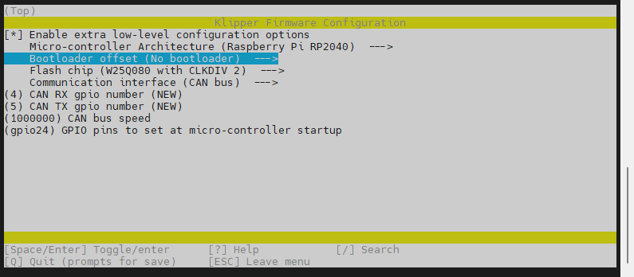
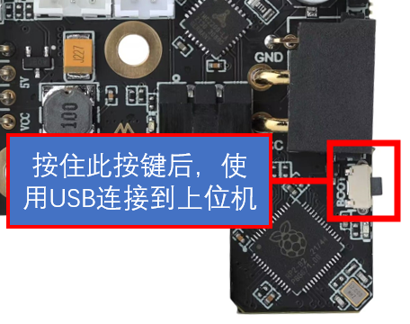
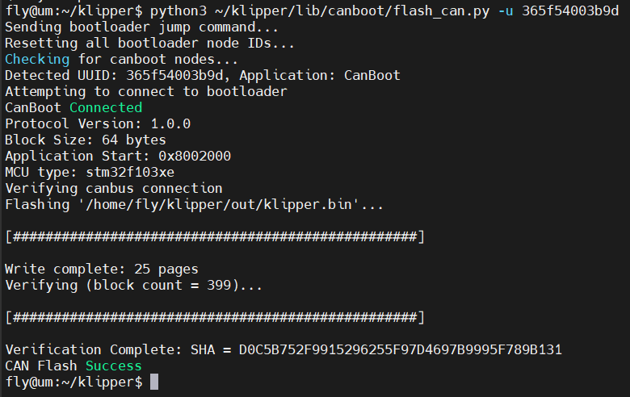

# 4. 固件编译和烧录

> [!TIP]
> 为测试，SB2040发货前会烧录CANBOOT固件，上电后所有引脚全部拉高，使用前请重新烧录

## 编译固件

> [!TIP]
> CanBoot固件默认500k，建议重新编译并且烧录1M的Canboot

编译固件前请确保 [连接到SSH](/board/fly_pi/FLY_π_description5 "点击即可跳转")

这里只进行简要说明，完整编译步骤请查看：[编译klipper固件](/board/fly_super8/firmware?id=_1-编译klipper固件 "点击即可跳转")。看到第 **13** 步即可！！！

> [!TIP]
> 固件配置方法只是参考，需要按主板提供配置来配置

**固件配置方法**


1. 修改klipper编译配置

    ```bash
    cd klipper
    rm -rf .config
    make menuconfig
    ```

    

<!-- tabs:start -->

### ****使用USB烧录固件****



编译

```bash
make clean
make -j4
```

最后出现``Creating uf2 file out/klipper.uf2``则编译成功

烧录固件

上位机配置CAN及UTOC使用请查看[上位机配置](/board/fly_sb2040/piconfig "点击即可跳转")

1. 查看是否连接到SB2040的BOOT烧录模式
   
    按住SB2040板的BOOT键，然后将usb连接到上位机

    
    
    ```bash
    lsusb
    ```
    
    执行上面的命令查看是否有 ``ID 2e8a:0003 Raspberry Pi RP2 Boot``这行，如没有请检查USB线(连接前记得按住BOOT键)


2. 烧录
   
    ```bash
    cd ~/klipper/
    make flash FLASH_DEVICE=2e8a:0003
    ```
    
   执行上面的命令可能会提示输入密码，输入当前用户的密码就好，输密码的时候是不可见的。输完之接按回车
   
   出现下图则烧录成功


### ****使用CANBOOT烧录固件****

>[!Tip]
>
>请确保工具板CAN速率与上位机的CAN速率完全一致，此方法需要将CAN线接好！！！


将下面命令中的``365f54003b9d``替换为[查找uuid](#_2-查找uuid "点击即可跳转")中查找到的uuid

```bash
python3 ~/klipper/lib/canboot/flash_can.py -u 365f54003b9d
```

如下图，出现``CAN Flash Success``则烧录成功




<!-- tabs:end -->

## 检查

如果正确配置编译并烧录成功，则SB2040板的这个灯会常亮


