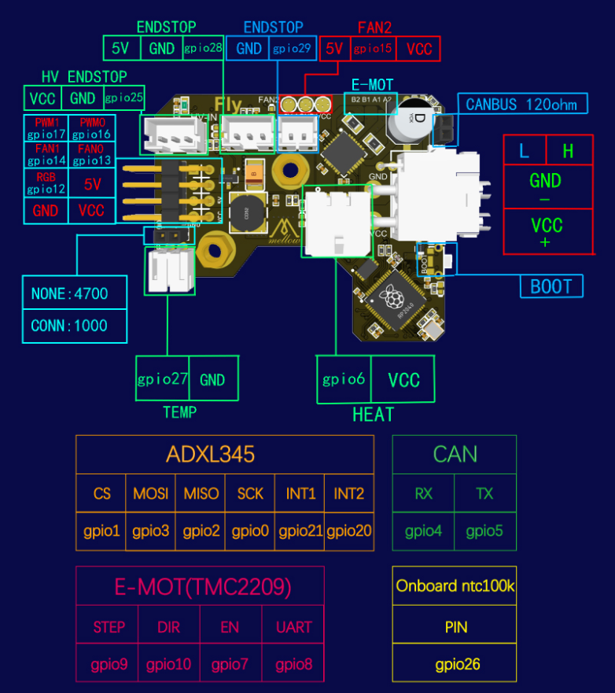

# SB2040使用教程

* 使用之前请确保已完成[固件烧录](/board/fly_sb2040/flash.md)

## 连接到上位机

* SB2040的线材颜色

| 颜色 | 功能 |
| :----: | :----- |
| 红色 | ***直流12/24v输入*** |
| 黑色 | ***直流负极(GND)*** |
| 黄色 | ***CAN H*** |
| 白色 | ***CAN L*** |

## 配置

1. 如果没有配置上位机CAN请查看[CAN使用](/advanced/can.md)
2. 如果没有烧录固件请查看[固件烧录](/board/fly_sb2040/flash.md)
3. 如果是FLY-Gemini主板可直接打开`http://ip:9999`或者[打开FLY-Tools](http://flygemini.lan:9999/)
4. 树莓派等其他设备

    进入SSH终端执行下面的命令

    ```bash
    ~/klippy-env/bin/python ~/klipper/scripts/canbus_query.py can0
    ```

    如果uuid已经在printer.cfg中则查询不到

    复制uuid 并将其填写到**printer.cfg**中

5. 具体配置请参考[示例配置](/board/fly_sb2040/cfg.md)

## 接线图

