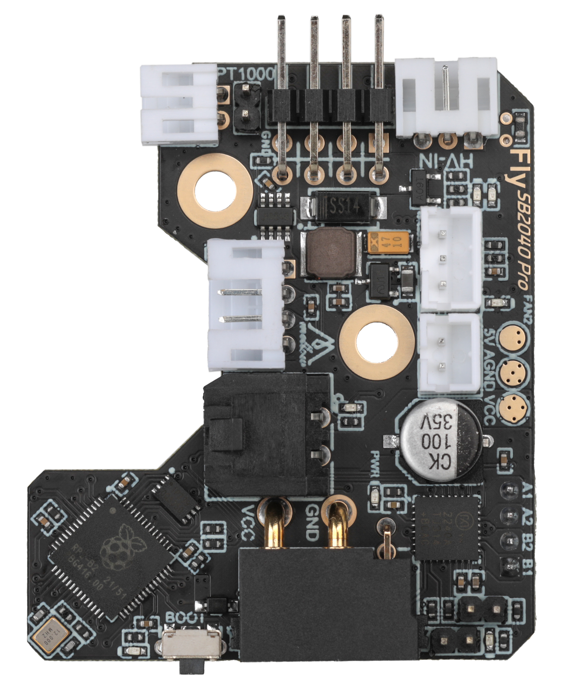

# 1. 产品简介

FLY SB2040-PRO是广州镁伦电子科技有限公司针对VORON Stealthburber打印头推出的一款喷头工具板，使用该工具板，可以用四根线来替代原来主板与打印头之间繁杂的接线，优化布局。SB2040-PRO适用于36步进电机，其集成了CAN收发器、USB口、TMC2240驱动、ADXL345加速度传感器，两个可控风扇等其他功能的工具板。此工具板适用于Klipper固件。

* 支持CAN总线连接，数据传输更稳定，延迟更小，连接更稳定
* 板载TMC2240驱动，使用SPI模式
* 板载ADXL345加速度传感器
* 支持BLTOUCH、PL08N等调平传感器，集成XY限位开关
* 支持12-24V电压输入 
* MCU：Raspberry Pi rp2040，Dual core ARM Cortex-M0+@133MHz
* 支持4.7K电阻(用于ntc热敏)或1K电阻(用于PT1000)切换
* can接口使用XT30（2+2），支持15A电流，峰值30A
* 板载NTC100k电阻，用于测仓温
* ADXL345的INT1和INT2接到mcu，给个别用户用于调平。
* 支持高压输入限位
* 赠送3米CAN连接线，避免用户无法正确压端子导致信号丢失的困扰
* 支持2/3/4线风扇
* 分体设计，Stealthburner方便拆卸
* 兼容hartk的Stealthburner Toolhead Board （风扇小板可以不用更换）
* 接口：可控风扇\*3，RGB\*1，限位\*3，加热管\*1，热敏\*1
* 支持PT100（MAX31865）

以下为SB2040-PRO相较于SB2040的升级内容
1. 板载TMC2209升级为TMC2240，发热更小
2. 修改部分布局，减少安装不当短路风险

## 1.1 产品详情

淘宝：[FLY3D打印机 Voron 2.4 R2 Trident Stealthburner Can工具头主板-淘宝网 (taobao.com)](https://item.taobao.com/item.htm?spm=a1z10.5-c-s.w4002-23066022675.36.68de3903lHTcFZ&id=681269728598 "点击即可跳转")

----

?> 重要

* 非FLY上位机请按 [上位机配置](/board/fly_sht36_42/piconfig "点击即可跳转") 文档配置好上位机
* 使用CanBoot请查看 [CanBoot使用](/advanced/canboot.md "点击即可跳转")

----

## 1.2 SB2040-PRO

