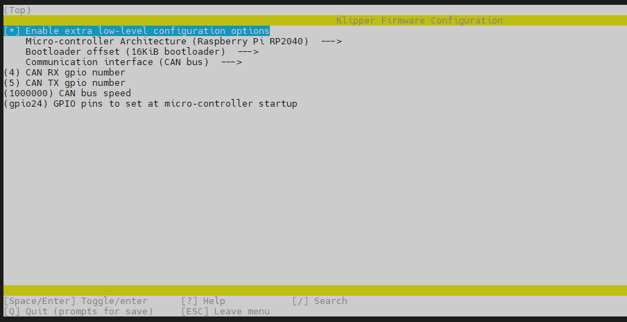
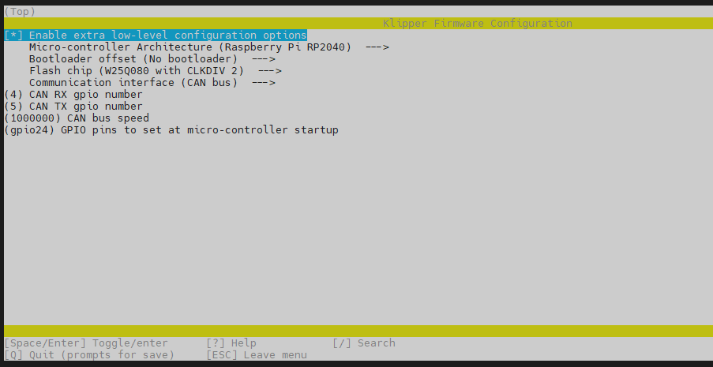

# 4. 固件编译和烧录

> [!TIP]
> 为测试，SB2040-Pro发货前会烧录katapult固件

## 1. 编译固件

> [!TIP]
> CanBoot固件默认1M

编译固件前请确保 [连接到SSH](/board/fly_pi/FLY_π_description5 "点击即可跳转")

这里只进行简要说明，完整编译步骤请查看：[编译klipper固件](/board/fly_super8/firmware?id=_1-编译klipper固件 "点击即可跳转")。看到第 **13** 步即可！！！

**固件配置方法**

1. 修改klipper编译配置

   ```bash
   cd && cd ~/klipper && rm -rf .config && make menuconfig
   ```
   
   配置如下图
   
   > [!TIP]
   >
   > 由于SB2040-Pro预装了CanBoot，支持CAN烧录，因此可以先尝试使用CanBoot烧录固件。如果不能使用CanBoot烧录可以使用USB来烧录！！

<!-- tabs:start -->

### ****SB2040-Pro 使用CanBoot烧录时编译此固件****

**感叹号是英文否则会编译错误**



编译

```bash
make clean && make -j4
```

 使用canboot烧录的固件最后出现**Creating hex file out/klipper.bin**则编译成功

> [!TIP]
> 请使用UTOC或者其他支持klipper USB桥接CAN的主板将SB2040-Pro与上位机通过CAN总线连接

> [!TIP]
> 如果已经烧录过klipper并且在正常运行，可跳过查找uuid，使用配置文件中的uuid进行烧录

首先进入ssh，然后依次输入以下指令

```
cd && git clone https://github.com/Arksine/katapult
```


1. 将下面命令中的``365f54003b9d``替换为[查找uuid](#_2-查找uuid "点击即可跳转")中查找到的uuid

```bash
python3 ~/klipper/lib/canboot/flash_can.py -u 365f54003b9d
```

2. 如下图，出现``CAN Flash Success``则烧录成功


### ****SB2040-Pro使用USB烧录时编译此固件****

**感叹号是英文否则会编译错误**

**使用USB烧录会覆盖CanBoot**



编译

```bash
make clean
make -j4
```

 使用usb烧录的固件最后出现**Creating uf2 file out/klipper.uf2**则编译成功

1. 查看是否连接到SB2040的BOOT烧录模式

按住SB2040板的BOOT键，然后将usb连接到上位机


```bash
lsusb
```

执行上面的命令查看是否有 ``ID 2e8a:0003 Raspberry Pi RP2 Boot``这行，如没有请检查USB线(连接前记得按住BOOT键)


2. 烧录
   
    ```bash
    cd ~/klipper/
    make flash FLASH_DEVICE=2e8a:0003
    ```
    
   执行上面的命令可能会提示输入密码，输入当前用户的密码就好，输密码的时候是不可见的。输完之接按回车
   
   出现下图则烧录成功


<!-- tabs:end -->

## 2. 检查

如果正确配置编译并烧录成功，则SB2040-PRO板的这个灯会常亮

