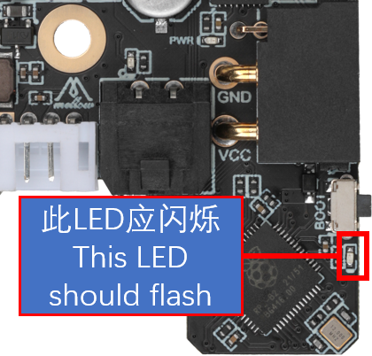
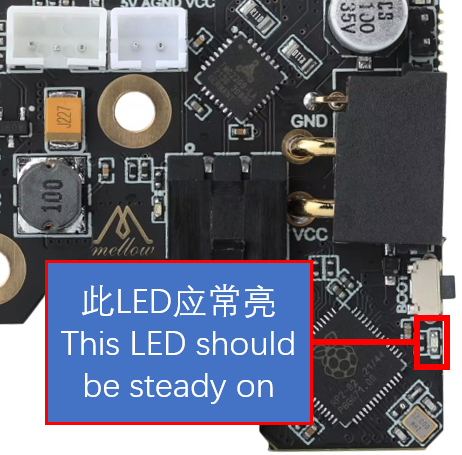

# 4. 固件编译和烧录

?> 为测试，SB2040-Pro发货前会烧录klipper固件，上电后所有引脚全部拉高，使用前请重新烧录

## 4.1 编译固件

编译固件前请确保 [连接到SSH](/board/fly_pi/FLY_π_description5 "点击即可跳转")

这里只进行简要说明，完整编译步骤请查看：[编译klipper固件](/board/fly_super8/firmware?id=_1-编译klipper固件 "点击即可跳转")。看到第 **13** 步即可！！！

1. 确保使用最新的klipper

    ```bash
    # 进入klipper目录并拉取最新的klipper
    cd ~/klipper && git pull
    ```

2. 修改klipper编译配置

   ```bash
   make menuconfig
   ```

   配置如下图

   ?> 由于SB2040-Pro预装了CanBoot，支持CAN烧录，因此可以先尝试使用CanBoot烧录固件。如果不能使用CanBoot烧录可以使用USB来烧录！！

    <!-- tabs:start -->

    ### **SB2040-Pro 使用CanBoot烧录时编译此固件**

    **感叹号是英文否则会编译错误**

    

    ### **SB2040-Pro使用USB烧录时编译此固件**

    **感叹号是英文否则会编译错误**

    **使用USB烧录会覆盖CanBoot**

    

    <!-- tabs:end -->

3. 编译

    ```bash
    make -j4
    ```

     使用canboot烧录的固件最后出现**Creating hex file out/klipper.bin**则编译成功
    
     使用usb烧录的固件最后出现**Creating uf2 file out/klipper.uf2**则编译成功
    
    
    

## 4.2 查找CAN uuid

?> 请使用UTOC或者其他支持klipper USB桥接CAN的主板将SB2040与上位机通过CAN总线连接

上位机配置CAN及UTOC使用请查看[上位机配置](/board/fly_sb2040/piconfig "点击即可跳转")

> 由于SB2040-PRO预装了CanBoot，支持CAN烧录，因此在固件烧录前需要读取uuid后才能烧录固件

在CanBoot状态下，下图所示指示灯会闪烁、如果不亮，或者没有闪烁，请重新 [烧录CanBoot引导固件](/advanced/canboot "点击即可跳转")，或使用 [USB烧录固件](/board/fly_sb2040_pro/flash?id=_43-使用usb烧录固件 "点击即可跳转")



首先进入ssh，然后依次输入以下指令

```
git clone https://github.com/Arksine/CanBoot
```


```
cd CanBoot
```

```bash
python3 ~/klipper/lib/canboot/flash_can.py -q
```

下图中高亮部分``365f54003b9d``就是这块SB2040-Pro板的uuid，这个uuid每块板子都不一样。同一块SB2040-Pro板烧录固件后uuid是不会变的


?>如果找不到CAN ID，请检查：

* 接线是否正确，例如CANH 和 CANL是否接反或者接触不良
* SB2040-PRO板上的120Ω跳线帽是否插上
* 您的镜像内核是否支持CAN

## 4.3 使用CanBoot烧录固件

1. 将下面命令中的``365f54003b9d``替换为[查找uuid](#_2-查找uuid "点击即可跳转")中查找到的uuid

```bash
python3 ~/klipper/lib/canboot/flash_can.py -u 365f54003b9d
```

2. 如下图，出现``CAN Flash Success``则烧录成功


3. 检查

   如果正确配置编译并烧录成功，则SB2040 Pro板的这个灯会常亮



## 4.4 使用USB烧录固件

1. 查看是否连接到SB2040的BOOT烧录模式

按住SB2040板的BOOT键，然后将usb连接到上位机


```bash
lsusb
```

执行上面的命令查看是否有 ``ID 2e8a:0003 Raspberry Pi RP2 Boot``这行，如没有请检查USB线(连接前记得按住BOOT键)


2. 烧录
   
    ```bash
    cd ~/klipper/
    make flash FLASH_DEVICE=2e8a:0003
    ```
    
   执行上面的命令可能会提示输入密码，输入当前用户的密码就好，输密码的时候是不可见的。输完之接按回车
   
   出现下图则烧录成功


3. 检查

如果正确配置编译并烧录成功，则SB2040-PRO板的这个灯会常亮

