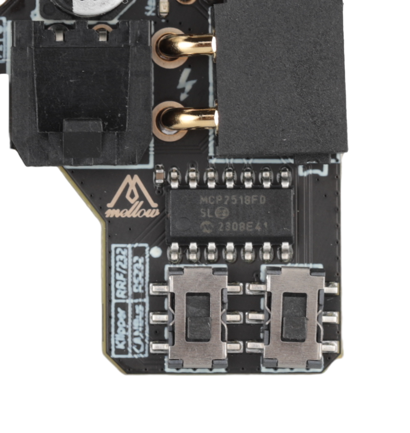
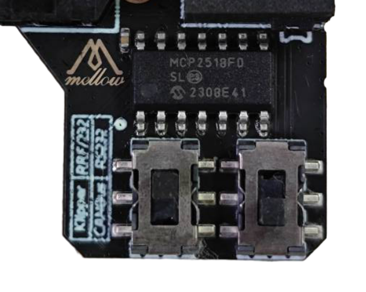

* **请注意SB2040 V3支持三种连接方式需要修改拨码并且烧录固件才可以正常连接**
* **请注意SB2040 V3支持三种连接方式需要修改拨码并且烧录固件才可以正常连接**
* **请注意SB2040 V3支持三种连接方式需要修改拨码并且烧录固件才可以正常连接**

## KLIPPPER使用CAN连接时候请将拨码拨到

**两个拨码都往下拨**

## KLIPPER使用RS232连接时候请将拨码拨到

**两个拨码都往上拨**

## RRF使用CAN连接时候请将拨码拨到

**左边拨码往上拨，右边拨码往下拨**

