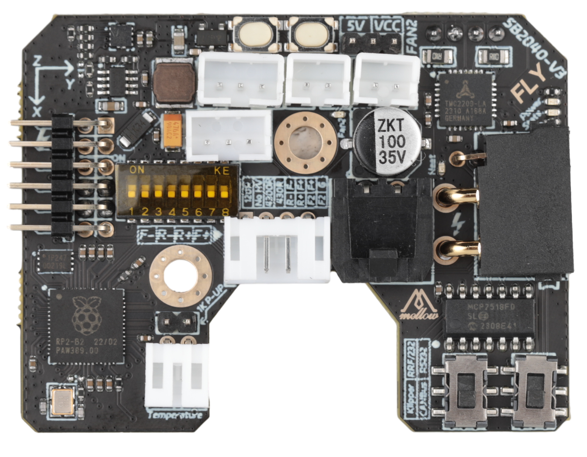

# 1. 产品简介

FLY SB2040 V3是广州镁伦电子科技有限公司针对VORON Stealthburber打印头推出的一款工具板，使用该工具板，可以用四根线来替代原来主板与打印头之间繁杂的接线，优化布局。SB2040适用于36步进电机，其集成了CAN收发器、RS232收发器、USB口、TMC2209驱动、LIS2DW加速度传感器，三个可控风扇等其他功能的工具板。此工具板适用于Klipper与RRF固件。

## 1.1 产品特点

* 预留BOOT，用户可使用USB进入BOOT模式更新固件
* 支持Klipper固件使用串口与CAN连接，其中CAN的端子电阻120R可通过拨码选择
* 支持CAN扩展，并预留CAN扩展接口
*  支持klipper使用串口连接 更稳定
* 温度传感器支持： 板载MAX31865芯片，兼容PT100和PT1000温度传感器。
* 将风扇mos移动到风扇小板避免损坏主板 ，最大输出电流可达1A
* 板载LIS2DW加速度传感器与LDC1612传感器（LDC1612只能给rrf使用）

## 1.2 产品参数

● MCU：Raspberry Pi rp2040，Dual core ARM Cortex-M0+@133MHz

● 连接接口使用XT30(2+2)连接器支持15A电流，峰值30A

● 固件：Reprap/Klipper

● 输入电压：DC12V-24V

● 逻辑电压：DC3.3V

● 板载传感器：LIS2DW与可选 ldc1612和max31865

● 加热棒接口: 加热棒（HEAT0）

● 扩展接口: RGB，EndStop，PT100/PT1000，XH2.54-2P CAN口

● 风扇接口：一路DC风扇，两路DC风扇或者PWM风扇

● 电机驱动：板载TMC2209

● 温度传感器：一路100K NTC或PT1000（TH0），一路PT100/PT1000可选

