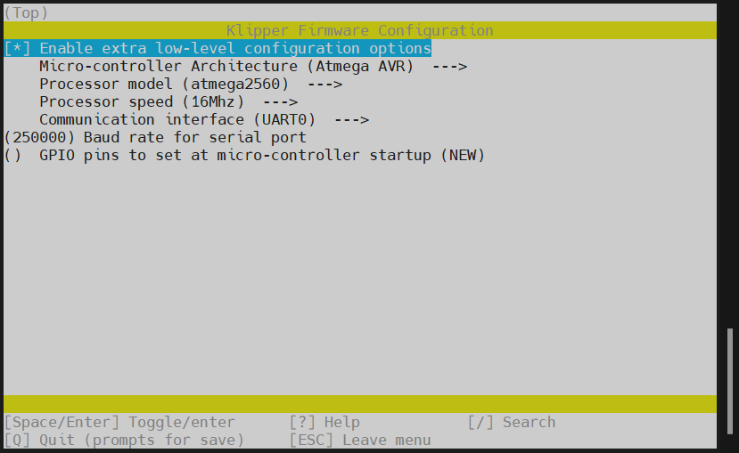
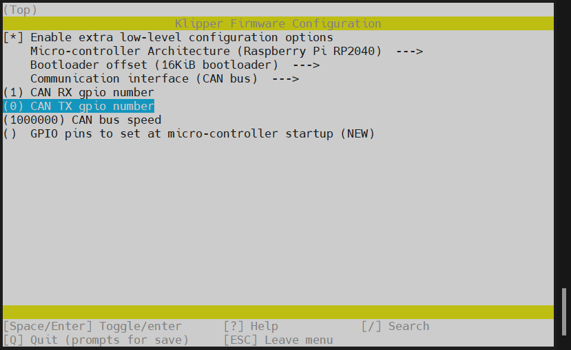
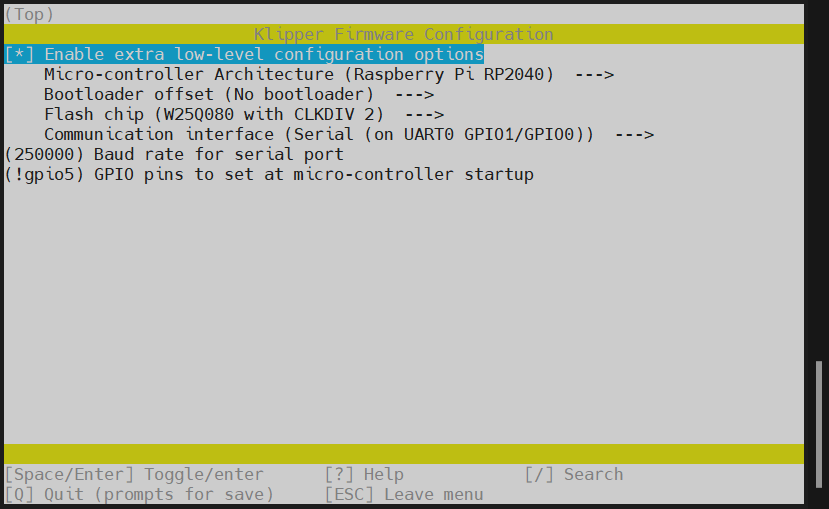
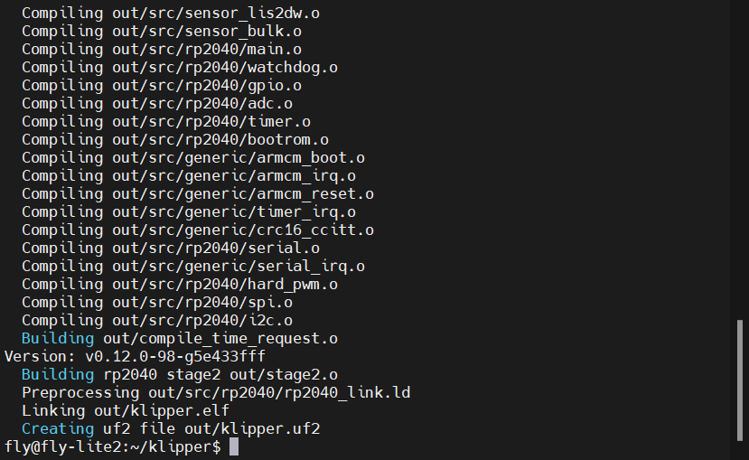
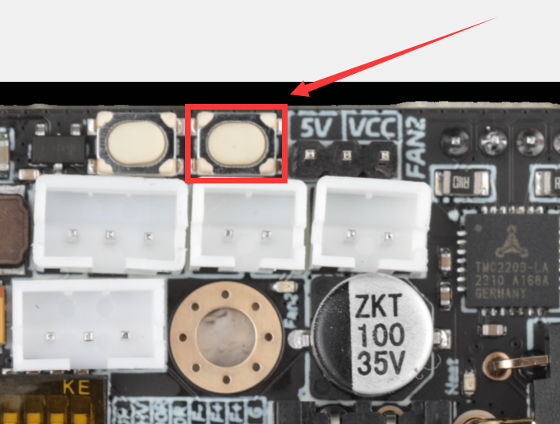
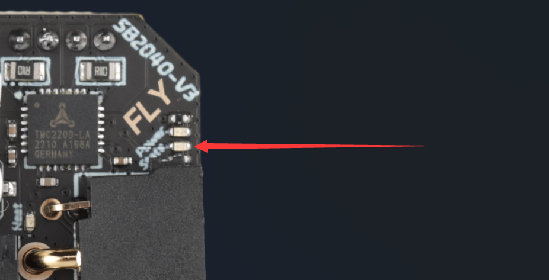

# 固件烧录

> [!Warning]
>
> 烧录固件之前确保已完成[上位机连接ssh](introduction/conntossh.md "点击即可跳转")文档
>
> SB2040 V3预先安装了katapult固件并且使用CAN连接，速率为1M

# 编译Klipper固件

请使用**MobaXterm_Personal**等**SSH工具**连接通过**网络**到您的上位机，并且需要确定以下几点

1. **请确保上位机安装好了Klipper服务**
2. **请确保登录的用户必须是安装好Klipper的用户**
3. **请确保你的输入法是英文**
4. **请确保你的上位机可以正常搜索到设备**
5. **请确保以上注意事项都做到，否则无法进行下一步**


* 连接到SSH后输入下面的命令并回车：

     ```
     cd  && cd ~/klipper  && make clean && rm -rf .config && make menuconfig
     ```

* 现在应该出现了Klipper编译配置界面，**↑ ↓ 键**选择菜单，**回车键**确认或进入菜单

<!-- tabs:start -->

### ****CAN 固件配置****
>[!TIP]
>请确保工具板拨码拨到正确位置
>
>**烧录时候请确保工具板已经正常连接到UTOC或者刷好桥接固件的工具板上**


* 选择`[ ] Enable extra low-level configuration options`然后回车



* 选择`    Micro-controller Architecture (Atmega AVR)  --->`回车进去找到`( ) Raspberry Pi RP2040`然后回车


* 选择`    Bootloader offset (No bootloader)  --->`回车然后选择`( ) 16KiB bootloader`在回车


* 选择`    Communication interface (USB)  --->`回车然后选择`( ) CAN bus`回车


* 选择`(4) CAN RX gpio number (NEW)`将**4**改成**1**
* 选择`(5) CAN TX gpio number (NEW)`将**5**改成**0**



* `(1000000) CAN bus speed`为can速率默认为1M，不建议自己修改
* 选择`()  GPIO pins to set at micro-controller startup (NEW)`输入`!gpio5`然后回车
* 请注意 **!** 请使用英文输入法输入


* 输入`Q`保存然后输入`Y`退出即可编译固件
* 输入`make`即可编译固件
* 出现`  Creating bin file out/klipper.bin`代表本次编译固件成功


**CAN烧录方法**

> [!TIP]
> 请使用UTOC或者其他支持klipper USB桥接CAN的主板将SB2040-V3与上位机通过CAN总线连接

> [!TIP]
>
> 请先看[Id读取](http://mellow.klipper.cn/#/board/fly_sb2040_v3_pro/uuid?id=can-id读取)接好线与上位机连接后在搜索CAN ID

> [!TIP]
> 如果已经烧录过klipper并且在正常运行，可跳过查找uuid，使用配置文件中的uuid进行烧录

首先进入ssh，然后依次输入以下指令

```
~/klippy-env/bin/python ~/klipper/scripts/canbus_query.py can0
```


1. 将下面命令中的``c5d882v0d121``替换为[查找uuid](#_2-查找uuid "点击即可跳转")中查找到的uuid

```bash
python3 ~/klipper/lib/canboot/flash_can.py -u c5d882v0d121
```

2. 如下图，出现``CAN Flash Success``则烧录成功


### ****RS232 固件配置****

>[!TIP]
>请确保工具板拨码拨到正确位置
>
>请注意因为RS232连接无法使用直接通过命令行重新进入SSH，只能通过USB更新固件



* 选择`[ ] Enable extra low-level configuration options`然后回车


* 选择`    Micro-controller Architecture (Atmega AVR)  --->`回车进去找到`( ) Raspberry Pi RP2040`然后回车


* 这一项`    Bootloader offset (No bootloader)  --->`不动
* 这一项`    Flash chip (W25Q080 with CLKDIV 2)  --->`不动

* 选择`    Communication interface (USB)  --->`回车然后选择`( ) Serial (on UART0 GPIO1/GPIO0)`回车


* 这一项为串口波特率。默认250K`(250000) Baud rate for serial port`不动

* 选择`()  GPIO pins to set at micro-controller startup (NEW)`输入`!gpio5`然后回车
* 请注意 **!** 请使用英文输入法输入


* 输入`Q`保存然后输入`Y`退出即可编译固件
* 输入`make`即可编译固件
* 出现`  Creating uf2 file out/klipper.uf2`代表本次编译固件成功



**USB烧录方法**

1. 按住SB2040板的BOOT键，然后将usb连接到上位机



```bash
lsusb
```

执行上面的命令查看是否有 ``ID 2e8a:0003 Raspberry Pi RP2 Boot``这行，如没有请检查USB线(连接前记得按住BOOT键)


2. 烧录
   
    ```bash
    cd ~/klipper/
    make flash FLASH_DEVICE=2e8a:0003
    ```
    

* 执行上面的命令可能会提示输入密码，输入当前用户的密码就好，输密码的时候是不可见的。输完之接按回车

   出现下图则烧录成功


<!-- tabs:end -->

### 确定固件烧录完成

* 如果固件刷完后此led会在微亮情况下变成常亮


