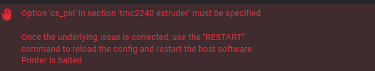

# 驱动注意事项

如果Klipper报下方错误



* 需要在SSH终端下登录到安装了klipper的用户下然后执行此代码

```
sed -i 's/"uart_pin"/\'"'"'uart_pin'\''/g' ~/klipper/klippy/extras/tmc2240.py
```

# 安装注意事项

* 请确保正确安装好工具板在通电

* 请确保接线正确
* 请确保连接拨码拨到正确位置