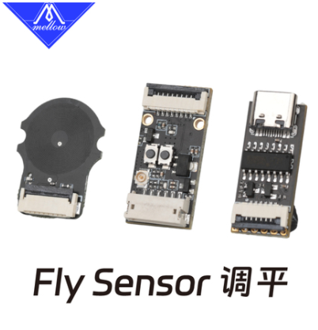
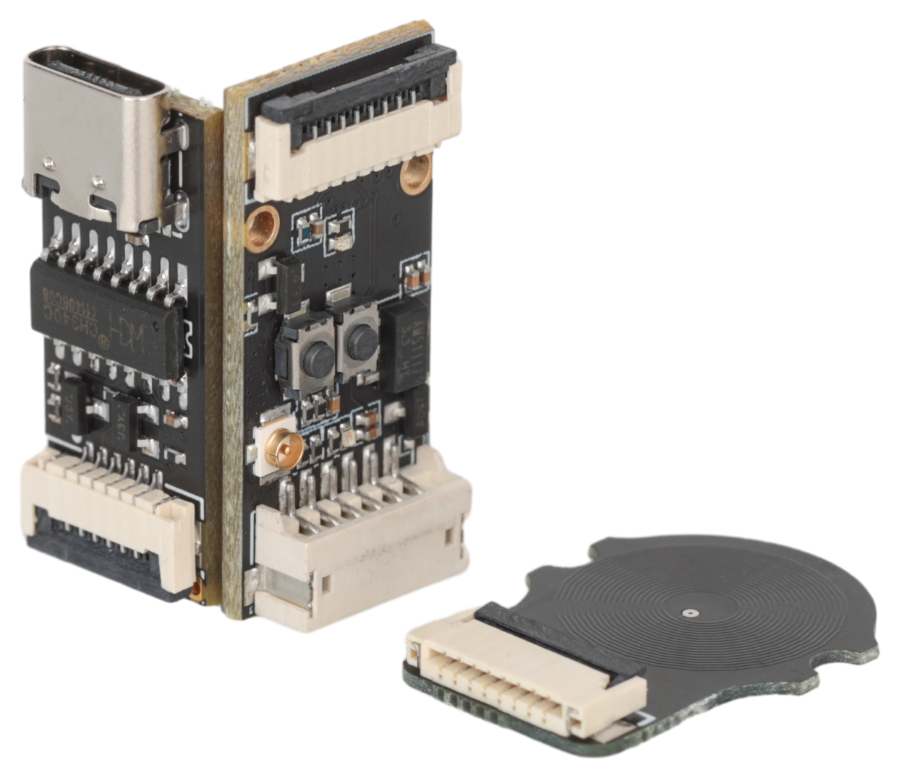

# Fly_sensor

这是基于无接触感应距离传感器做得3D打印机热床扫床元器件，可以实现仅XY轴移动而不需要升降z轴进行测量热床平整度，从而实现网床打印，目前基于6*6的网格300MM热床，在200mm/s的速度扫床预计需要时间大约22秒，并且扫描出来的网床效果优于一般国产touch传感器，可以实现比较好的打印结果.对于打印小件比较多，并且热床本身不太平整，每次取打印件之后都会影响热床高度的用户将是非常有效的工具。目前是测试版本会用比较优惠的价格出售，暂时只支持网格扫描模式。套装里面有3个小板子，其中两个小板用于扫床使用，一个单独的小板用于烧录固件未来传感器升级使用。这个不是国外克隆版本，代码是团队重新编写，暂时无法达到国外扫床版本要求，请慎重选择。

功能

* 代替z轴限位
* 扫描时无需升降z轴，提高打印速度
* XY移动扫描,可进行密集网床探测

----

连接

* 电源：5V
* 固件： KLIPPER
* 连接：工具板/主板
* 热床：普通PEI，铝板热床等金属表面热床，不支持磁铁打孔热床与非金属表面热床

----

