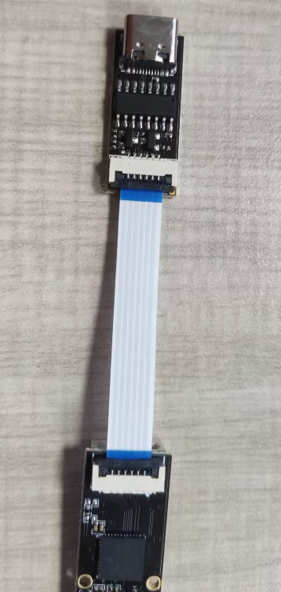
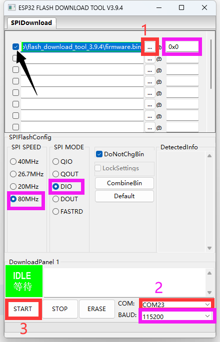

# 固件升级

## 接线

?>**注意FPC排线方向正反**

?>**需要将其他线断开连接**

?>**需要将type-c连接到电脑**

## 固件升级（USB）

?>**FLY-SENSOR已经自带固件**
* 升级固件则需要使用USB将Fly_sensor连接到电脑来升级

1. 下载并解压USB烧录工具[flash_download_tool_3.9.4.zip(点击下载)](https://cdn.mellow.klipper.cn/Utils/flash_download_tool_3.9.4.zip)
2. 下载固件: **[firmware](https://cdn.mellow.klipper.cn/firmware/Fly_sensor.bin)**
3. 打开``flash_download_tool_3.9.4.exe``，注意：打开烧录工具后会先弹出一个CMD窗口，然后再弹出烧录工具的界面，一定不要关闭CMD窗口
4. 在烧录工具中``ChipType:``选择``ESP32``
5. 在烧录工具中``WorkMode:``选择``Develop``
7. 最后再点击``OK``,可参考下图1

    

    

?> 上图2中的``紫色框选区域``必须保证和图片中一致，不可自行修改

7. 黑色箭头需要勾选，其他选项不需要勾选
9. 将fly_sensor通过USB-Typec数据线连接到电脑
10. 点击上图2中的``红色区域1``按钮选择你下载的固件
11. 点击上图2中的``红色区域2``选择fly_sensor的串口
12. 点击上图2中的``红色区域3``开始烧录，等待烧录完成后重启fly_sensor即可完成固件刷写（必须等待提示烧录完成后才能断开fly_sensor的线）

?>**使用完可将烧录器与FPC排线拆下**
