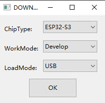
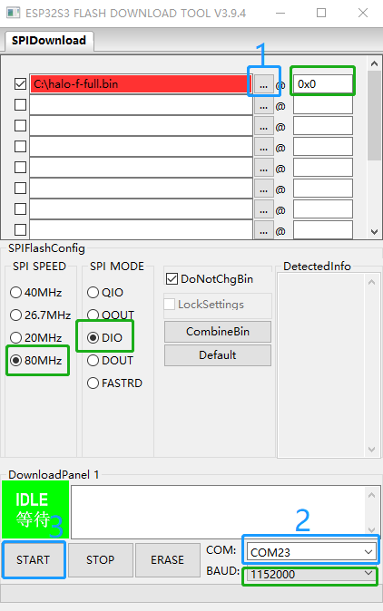

# 固件升级

## 全量升级（USB）

* 升级固件则需要使用USB将Fly_sensor连接到电脑来升级

?> 全量升级您的原有设置将不会保留，所有设置都会恢复默认

1. 下载并解压USB烧录工具[flash_download_tool_3.9.4.zip(点击下载)](https://cdn.mellow.klipper.cn/Utils/flash_download_tool_3.9.4.zip)
2. 下载固件[Halo固件下载](/board/fly_halo/firmware)
3. 打开``flash_download_tool_3.9.4.exe``，注意：打开烧录工具后会先弹出一个CMD窗口，然后再弹出烧录工具的界面，一定不要关闭CMD窗口
4. 在烧录工具中``ChipType:``选择``ESP32-S3``
5. 在烧录工具中``WorkMode:``选择``Develop``
6. 在烧录工具中``LoadMode:``选择``USB``
7. 最后再点击``OK``,可参考下图1

    
    

    

?> 上图2中的``绿色框选区域``必须保证和图片中一致，不可自行修改

8. 将fly_sensor通过USB-Typec数据线连接到电脑
9. 点击上图2中的``蓝色区域1``按钮选择你下载的固件
10. 点击上图2中的``蓝色区域2``选择fly_sensor的串口（如果没有，可以按住fly_sensor背面的``B``按键不放，然后再连接电脑）
11. 点击上图2中的``蓝色区域3``开始烧录，等待烧录完成后重启fly_sensor即可完成全量升级（必须等待提示烧录完成后才能断开fly_sensor的线）
