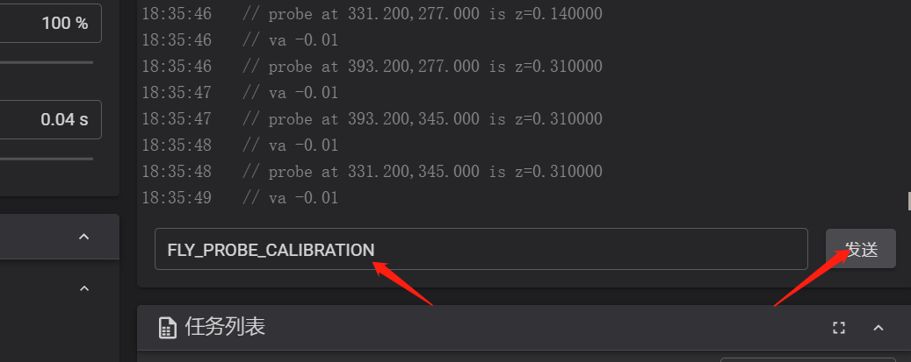
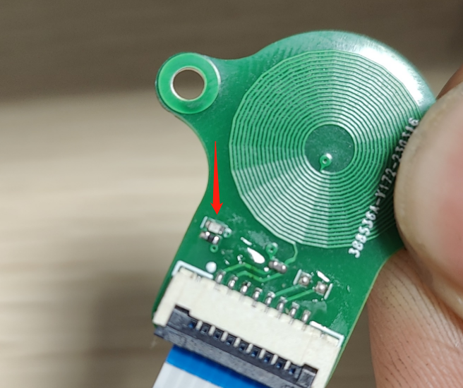
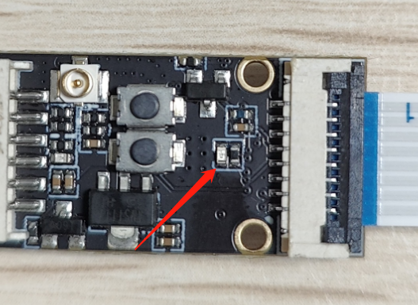
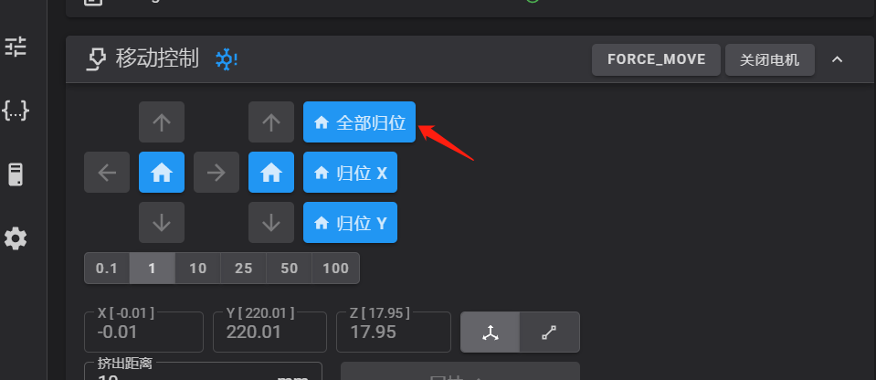
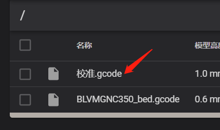

# 使用说明

```
[fly_probe]
calibration_pin:2040:PB1          # 舵机口接校准
probe_pwm_pin:2040:PC15           # 限位口接pwm

[probe]
pin:2040:PA1                      # 限位口接zstop
x_offset: -23.2
y_offset: 5
z_offset: 0.00
speed: 10
lift_speed: 5
```

?>**手动/半自动将喷嘴移动到距离热床0.2mm距离（越低越好，0.2安全点，熟练使用后可以更低）**




### 1. 控制台发送

```
FLY_PROBE_CALIBRATION
```

（这一步是记录ztop触发点）

发送完以后，模块这里的灯一般会亮起来/闪烁

（如果未亮，点击紧急停止重启一下，然后重新发送命令）





## 2. 归位



归为完成后将Z移动到0坐标（框里可以直接输入0）


然后打印校准文件

