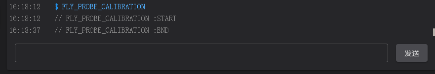

# 使用说明

## 1. 移动喷嘴

> [!TIP]
> **手动/半自动将喷嘴移动到距离热床0.2mm距离**

> [!TIP]
> **可以使用铁片/pei等金属物品可以提前触发,在校准完成后可以在正常归位**

## 2. 控制台发送

```bash
FLY_PROBE_Z0
```

（这一步是记录ztop触发点）

发送完以后，模块这里的灯一般会亮起来/闪烁

（如果未亮，点击紧急停止重启一下，然后重新发送命令）


## 3. 归位


归位以后在控制台输入

自动校准

```bash
FLY_PROBE_CALIBRATION
```


