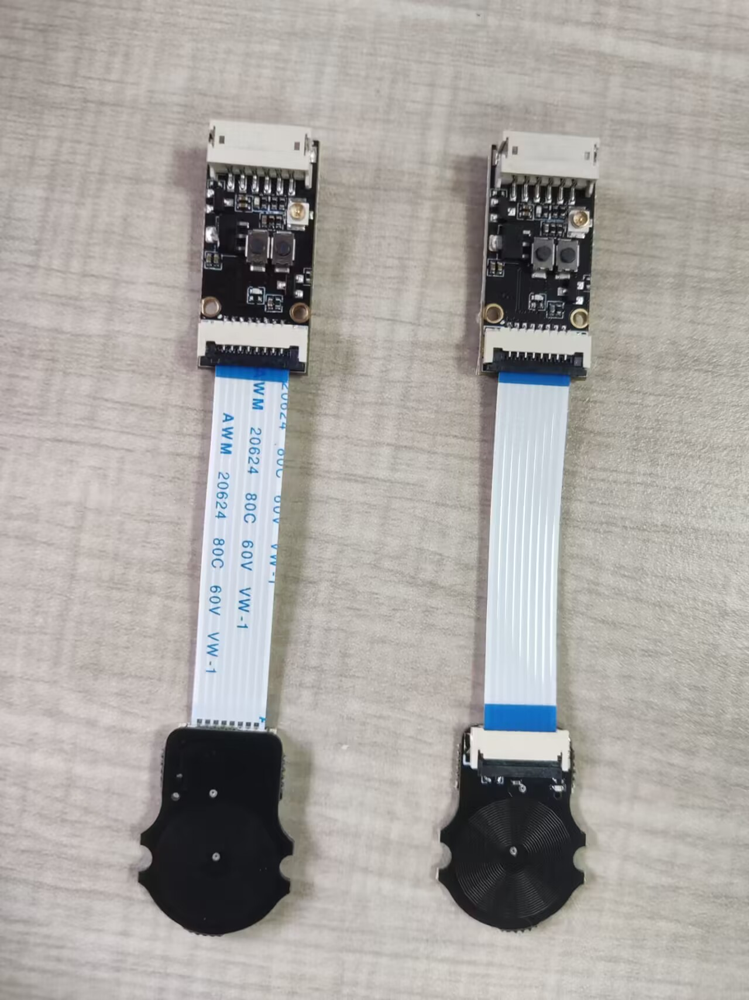
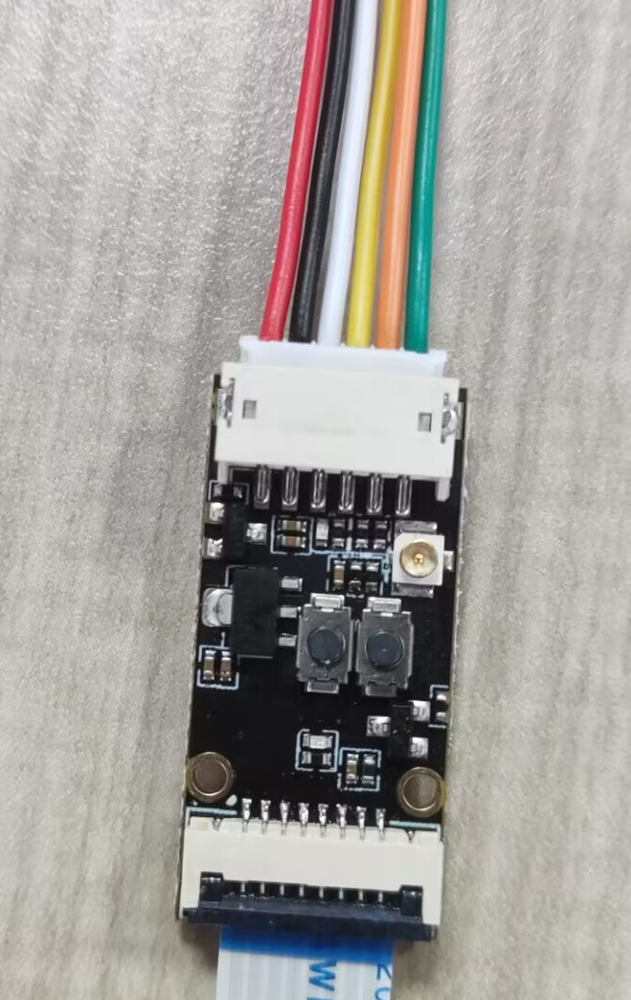

# 安装指导

## 1. FPC接线

> [!TIP]
> **Fly-Sensor自带FPC排线两条，正向一条反向**

## 2. 线序分布

|       功能        |            |
| :---------------: | :--------- |
|        5V         | ***红色*** |
|        GND        | ***黑色*** |
|        NC         | ***白色*** |
|       ZSTOP       | ***黄色*** |
|        PWM        | ***橙色*** |
| Servo signal port | ***绿色*** |

> [!TIP]
> **白色可以剪断**

## 3. 工具板接线

###  3.1 SHT36-V2

|       功能        |   GPIO    |
| :---------------: | :--------- |
|        5V         | ***5V*** |
|        GND        | ***GND*** |
|        NC         | ***无*** |
|       ZSTOP       | ***PA2*** |
|        PWM        | ***PC15*** |
| Servo signal port | ***PB1*** |

###  3.2 SHT36-Pro

|       功能        |   GPIO    |
| :---------------: | :--------- |
|        5V         | ***5V*** |
|        GND        | ***GND*** |
|        NC         | ***无*** |
|       ZSTOP       | ***gpio2*** |
|        PWM        | ***gpio7*** |
| Servo signal port | ***gpio3*** |

###  3.3 SB2040

> [!TIP]
> **SB2040**使用Servo signal port需要拆掉电容[SB2040-Pro](https://mellow-old.klipper.cn/#/board/fly_sb2040_pro/sb2040line)

|       功能        |   GPIO    |
| :---------------: | :--------- |
|        5V         | ***5V*** |
|        GND        | ***GND*** |
|        NC         | ***无*** |
|       ZSTOP       | ***gpio29*** |
|        PWM        | ***gpio17*** |
| Servo signal port | ***gpio28*** |

