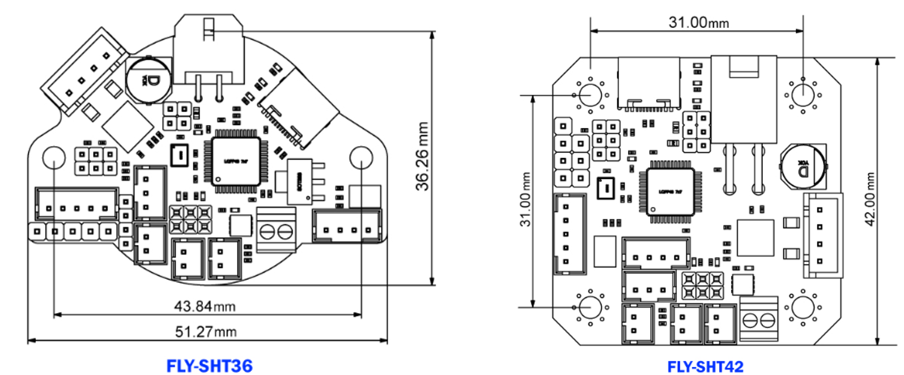
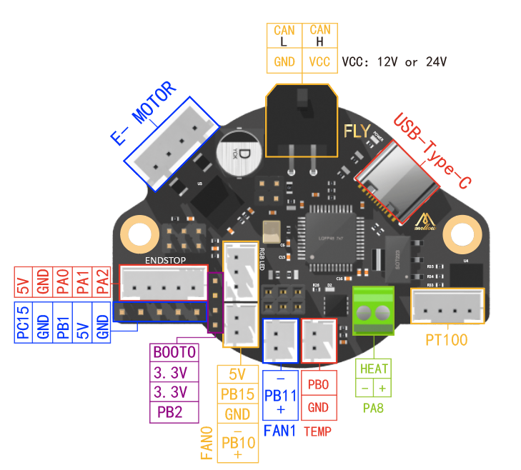

# 产品简介

FLY SHT36/42是广州镁伦电子科技有限公司针对3D打印机挤出头设计的喷头工具板，使用该工具板，可以用四根线来替代原来主板与打印头之间繁杂的接线，优化布局。SHT36适用于36步进电机，SHT42适用于42步进电机，其集成了CAN收发器、USB口、TMC2209驱动、ADXL345加速度传感器，两个可控风扇等其他功能的工具板。此工具板适用于Klipper固件。

* 体积压缩极致，采用6层板设计
* 支持CAN总线连接，数据传输更稳定，延迟更小，连接更稳定
* 板载TMC2209驱动，使用UART模式，可用于挤出机
* 板载ADXL345加速度传感器
* 支持PT100（MAX31865）
* 可更换风扇MOS设计
* 持BLTOUCH、PL08N等调平传感器，集成XY限位开关
* 支持12-24V电压输入 
* MCU: STM32F072
* 通信: CANBUS, USB
* 接口：可控风扇\*2，RGB\*1，限位\*3，Probe\*1，Servo\*1，加热管\*1，热敏\*1，PT100\*1

## 产品详情

淘宝：[FLY 3D打印机 Can工具头板适用于KlIpper兼容双子座主板和树莓派-淘宝网 (taobao.com)](https://item.taobao.com/item.htm?spm=a1z10.5-c-s.w4002-23066022675.22.68de3903lHTcFZ&id=671792739826 "点击即可跳转")

产品参数：

1. 外观尺寸：51.27mm*36.26mm（SHT36），42mm*42mm（SHT42）

2. 安装尺寸：孔间距43.84mm，M3安装孔径

3. 处理器：STM32F072C8T6

4. 输入电压：DC12-24V 5A

5. 加热棒最大输出电流：5A

6. 风扇接口最大输出电流1A

?> FLY-SHT36与SHT42除了外形不同外，接口配置完全一致

?> 重要

* 非FLY上位机请按[CAN使用](/advanced/can_rpi.md)文档配置好CAN
* 使用CanBoot请查看[CanBoot使用](/advanced/canboot.md)

----

## SHT-36

## SHT-42

