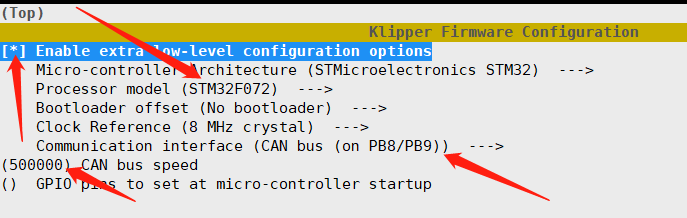

# 4. 固件烧录

SHT36/42在出厂时并未刷写固件，因此在使用前需要为CAN工具板重新编译并烧写固件后，才能使用CANBUS。

## 4.1 编译固件

编译固件前请确保 [连接到SSH](/board/fly_pi/FLY_π_description5 "点击即可跳转")

这里只简要介绍固件编译参数，详细固件编译步骤请查看：[编译klipper固件](/board/fly_super8/firmware?id=_1-编译klipper固件 "点击即可跳转")。 看到第 **13** 步即可！！！

配置参数如下：



## 4.2 烧录固件 

?> SHT板连接到电脑或者上位机之前必须安装下面图中的短接跳线帽，否则SHT板无法进入USB烧录模式

* 进入SHT36,SHT42的USB烧录模式


* 实图


### 4.2.1 上位机烧录

1. 安装烧录工具

```bash
sudo apt install dfu-util -y
```

2. 使用Type-C数据线将SHT板连接到Linux设备，请确保连接前已安装**短接跳线**
3. 执行下面的命令查看是否连接成功,复制蓝色框中的USB ID

```bash
lsusb
```


4. 烧录固件(烧录前确保已经编译过固件),将下面命令中的**0483:df11**替换为前面复制的USB ID

```bash
dfu-util -a 0 -d 0483:df11 --dfuse-address 0x08000000 -D ~/klipper/out/klipper.bin
```

5. 没有报错则烧录成功,如果出现报错请重新检查每个步骤操作


6. 出现上图内容则烧录成功

?> 注意：烧录成功后一定记得拔下来跳线帽

### 4.2.2 电脑烧录

1. 下载烧录工具[STM32CubeProgrammer](https://cdn.mellow.klipper.cn/Utils/STM32CubeProgrammer.zip)
2. 解压烧录工具到任意目录，进入`STM32CubeProgrammer/bin`目录，双击打开`STM32CubeProgrammer.exe`
3. 将前面编译好的固件(klipper.bin)复制到电脑任意目录
4. 使用Type-C数据线将SHT板连接到电脑，请确保连接前已安装短接跳线
5. STM32CubeProgrammer中选择USB模式，并刷新，连接


6. 如果没有出现错误弹窗则连接成功
7. 打开固件文件，在弹窗中选择前面编译完成的固件文件(klipper.bin)


8. 确认页面有内容，不是00000。然后点击**Download**


9. 出现图中就是烧录成功


?> 如果使用电脑不能成功烧录，请使用上位机烧录


