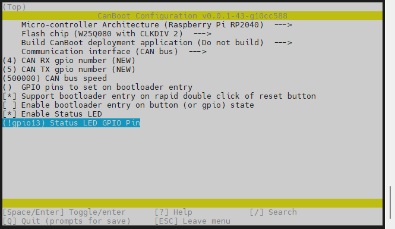

# 10. CanBoot

什么是CanBoot？

CanBoot是一种为ARM Cortex-M mcu设计的引导加载程序。这个引导加载程序最初是为CAN节点设计的，以便与Klipper一起使用。引导加载程序本身利用了Klipper的硬件抽象层，将内存占用最小化。除了CAN, CanBoot现在还支持USB和UART接口。目前支持lpc176x、stm32和rp2040三种mcu。CAN支持目前仅限于stm32 f系列和rp2040设备。

Klipper已支持CanBoot，通过CANBUS直接烧录固件。使用CanBoot后为SHT36/42板更新klipper固件无需再连接USB线，保持现有的CAN连接的情况下可直接烧录固件，能够更便捷、高效的更新CAN工具板的固件。

* 这里提供编译好的CANBOOT速率是1M，其他速率请自行配置

```
https://cdn.mellow.klipper.cn/BL/FLY_ERCF_CANBOOT_1M.uf2
```

## 1. 下载CanBoot

1. 进入SSH终端
2. 执行以下命令

```bash
git clone https://github.com/Arksine/CanBoot
cd CanBoot
```


```bash
make menuconfig
```

* 请注意自己使用的主板型号

<!-- tabs:start -->

## 2. 编译CANBOOT固件

> [!TIP]
> 如果您的CanBoot选项中没有RP2040请拉取最新的CanBoot



## 3. 使用Type-C烧录固件


**短接跳线插上type-c到电脑会弹出RPI-RP2**

**弹出RPI-RP2后不需要在短接rst**


**把canboot.uf2放进去，弹窗会关闭**

## 4. 查找uuid

> [!TIP]
> 请使用UTOC或者其他支持klipper USB桥接CAN的主板将FLY-SHT36 Pro与上位机通过CAN总线连接

> [!TIP]
> 如果已经烧录过klipper并且在正常运行，可跳过查找uuid，使用配置文件中的uuid进行烧录

> 由于FLY-SHT36 Pro预装了CanBoot，支持CAN烧录，因此在固件烧录前需要读取uuid后才能烧录固件

首先进入ssh，然后依次输入以下指令

```bash
git clone https://github.com/Arksine/CanBoot
```


```bash
cd CanBoot
```

```bash
python3 ~/klipper/lib/canboot/flash_can.py -q
```

下图中高亮部分``365f54003b9d``就是这块FLY-SHT36-PRO板的uuid，这个uuid每块板子都不一样。同一块FLY-SHT36-PRO板烧录固件后uuid是不会变的


> [!TIP]
> 如果找不到CAN ID，请检查：

* 接线是否正确，例如CANH 和 CANL是否接反或者接触不良
* FLY-SHT36 Pro板上的120Ω跳线帽是否插上
* 您的镜像内核是否支持CAN

如果确认没有上述问题，则可以使用使用上位机的USB来烧录固件。
