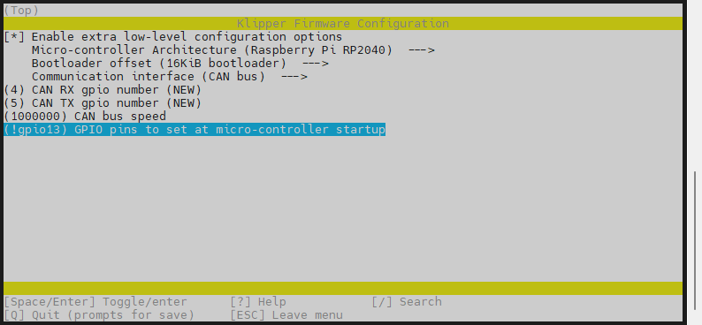
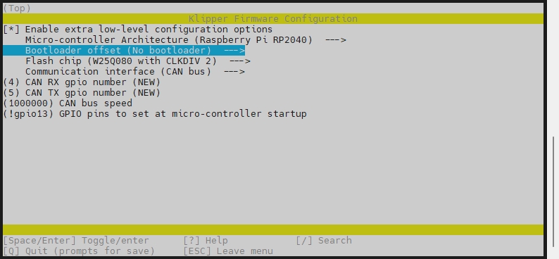
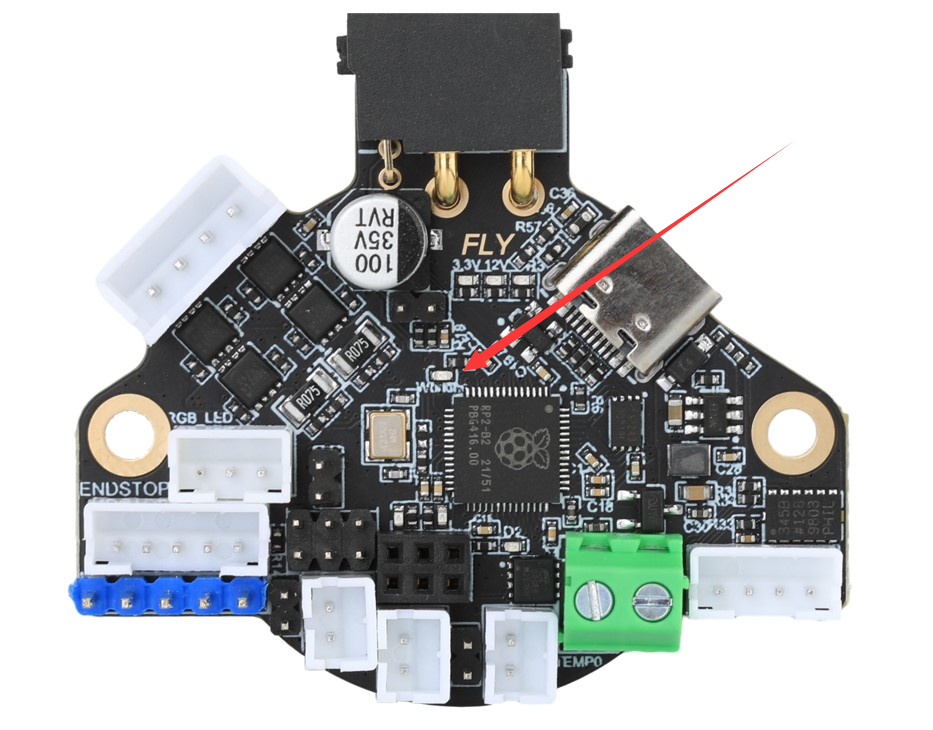

# 4. 固件烧录

> [!TIP]
> SHT36 Pro预装了CanBoot，支持CAN烧录，烧录前请使用CAN连接到上位机；也可以使用Type-C数据线连到到上位机，使用USB烧录

> [!TIP]
>
> SHT36PRO因上位机差异可能导致驱动无法使用，可以试一下这个固件使用CAN速率1M[下载链接](https://cdn.mellow.klipper.cn/BL/SHT36PRO/SHT36PRO_KLIPPER_CAN_1M.uf2)

## 4.1 编译固件

> [!TIP]
> CanBoot固件默认1M

编译固件前请确保 [连接到SSH](/board/fly_pi/FLY_π_description5 "点击即可跳转")

这里只简要介绍固件编译参数，详细固件编译步骤请查看：[编译klipper固件](/board/fly_super8/firmware?id=_1-编译klipper固件 "点击即可跳转")。 看到第 **13** 步即可！！！

**固件配置方法**

1. 修改klipper编译配置

    ```bash
    cd ~/klipper && rm -rf .config && make menuconfig
    ```
    

配置如下图

<!-- tabs:start -->
    
### ****SHT36 Pro 使用CANBOOT烧录时编译此固件****

**感叹号是英文否则会编译错误**



编译
    
```bash
make clean && make -j4
```

 使用canboot烧录的固件最后出现**Creating hex file out/klipper.bin**则编译成功
    
### 使用CANBOOT烧录

> [!TIP]
    > 请使用UTOC或者其他支持klipper USB桥接CAN的主板将SHT36-Pro与上位机通过CAN总线连接

> [!TIP]
    > 如果已经烧录过klipper并且在正常运行，可跳过查找uuid，使用配置文件中的uuid进行烧录

首先进入ssh，然后依次输入以下指令
    
```
cd && git clone https://github.com/Arksine/katapult
```


```bash
cd ~/klipper && python3 ~/klipper/lib/canboot/flash_can.py -q
```

下图中高亮部分``365f54003b9d``就是这块SHT36 -Pro板的uuid，这个uuid每块板子都不一样。同一块SHT36 -Pro板烧录固件后uuid是不会变的


    

1. 将下面命令中的``365f54003b9d``替换为[查找uuid](#_2-查找uuid "点击即可跳转")中查找到的uuid

   

```bash
python3 ~/klipper/lib/canboot/flash_can.py -u 365f54003b9d
```


2. 如下图，出现``CAN Flash Success``则烧录成功
   


    
> [!TIP]
    > 如果找不到CAN ID，请检查：

* 接线是否正确，例如CANH 和 CANL是否接反或者接触不良
    * SHT36 PRO板上的120Ω跳线帽是否插上
    * 您的镜像内核是否支持CAN
    
    
    
## ****SHT36 Pro 使用USB烧录时编译此固件****



编译
    

```bash
    make clean
    make -j4
```

 使用canboot烧录的固件最后出现**Creating hex file out/klipper.uf2**则编译成功
    
### 使用Type-C烧录固件


短接跳线插上type-c到电脑会弹出RPI-RP2

弹出RPI-RP2后不需要在短接BOOT


    


把klipper.uf2放进去，弹窗会关闭

<!-- tabs:end -->

## 4.2 检查

如果成功进入klipper，下图中的LED灯会常亮



