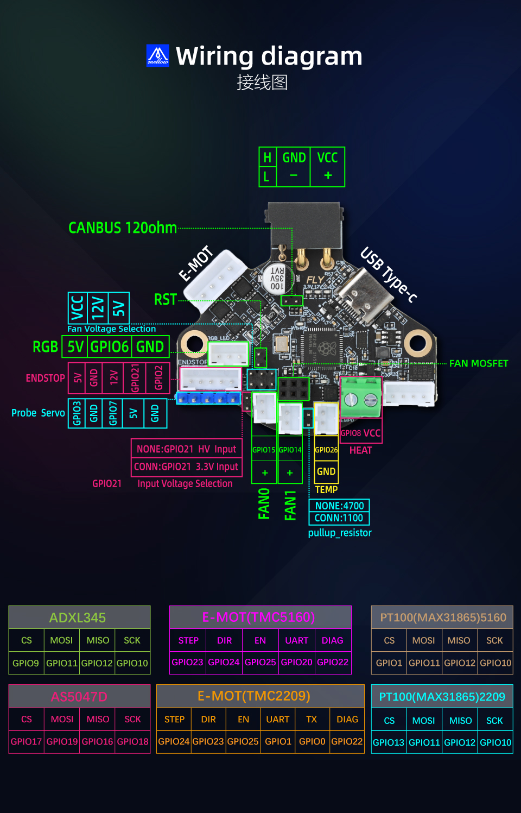

# 6. 引脚分布

## SHT36-PRO引脚

### 通信

* CANBUS

| 功能 | 引脚号      |
| :--: | :---------- |
|  RX  | ***GPIO4*** |
|  TX  | ***GPIO5*** |

### 步进电机驱动部分

* 5160驱动

| 驱动 | 功能 | 引脚号       |
| :--: | :--: | :----------- |
|  E   |  EN  | ***GPIO25*** |
|  E   | STEP | ***GPIO23*** |
|  E   | DIR  | ***GPIO24*** |
|  E   |  CS  | ***GPIO20*** |
|  E   | DIAG | ***GPIO22*** |

### 限位

| 限位 | 引脚号       |
| :--: | :----------- |
|  1   | ***GPIO21*** |
|  2   | ***GPIO2***  |

### 加热控制

|   功能   | 引脚号      |
| :------: | :---------- |
| 挤出加热 | ***GPIO8*** |

### 温度传感器

|   功能   | 引脚号       |
| :------: | :----------- |
| 挤出温度 | ***GPIO26*** |
| 板载NTC  | ***GPIO27*** |

### 舵机与探针

| 功能 | 引脚号      |
| :--: | :---------- |
| 舵机 | ***GPIO7*** |
| 探针 | ***GPIO3*** |

### 风扇

| 功能  | 引脚号       |
| :---: | :----------- |
| 风扇0 | ***GPIO15*** |
| 风扇1 | ***GPIO14*** |

### RGB

| 功能 | 引脚号      |
| :--: | :---------- |
| RGB1 | ***GPIO6*** |

## SPI设备

* TMC5160

|    功能     | 引脚号       |
| :---------: | :----------- |
|    MISO     | ***GPIO12*** |
|    MOSI     | ***GPIO11*** |
|     CLK     | ***GPIO10*** |
| MAX31865-CS | ***GPIO1***  |
| ADXL345-CS  | ***GPIO9***  |

* TMC5160 

|    功能    | 引脚号       |
| :--------: | :----------- |
|    MISO    | ***GPIO16*** |
|    MOSI    | ***GPIO19*** |
|    CLK     | ***GPIO18*** |
| AS5047D-CS | ***GPIO17*** |

