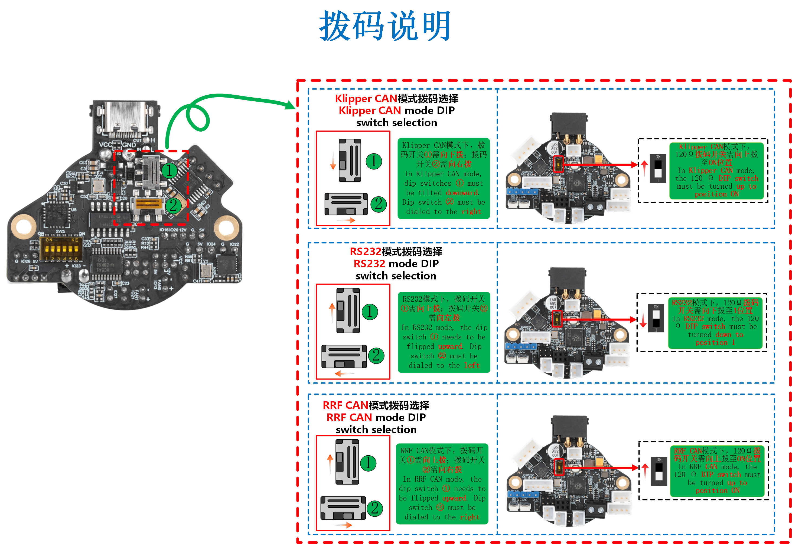

* **请注意SHT36 V3支持三种连接方式，需要修改拨码并且烧录固件才可以正常连接**
* **请注意SHT36 V3支持三种连接方式，需要修改拨码并且烧录固件才可以正常连接**
* **请注意SHT36 V3支持三种连接方式，需要修改拨码并且烧录固件才可以正常连接**

>[!WARNING]
>
>由于图片分辨率太高，在网页上浏览无法看清，请将**鼠标光标放在接线图上方**，**单击右键**，选择 **图片另存为** ，将图片保存到桌面再查看！！！

