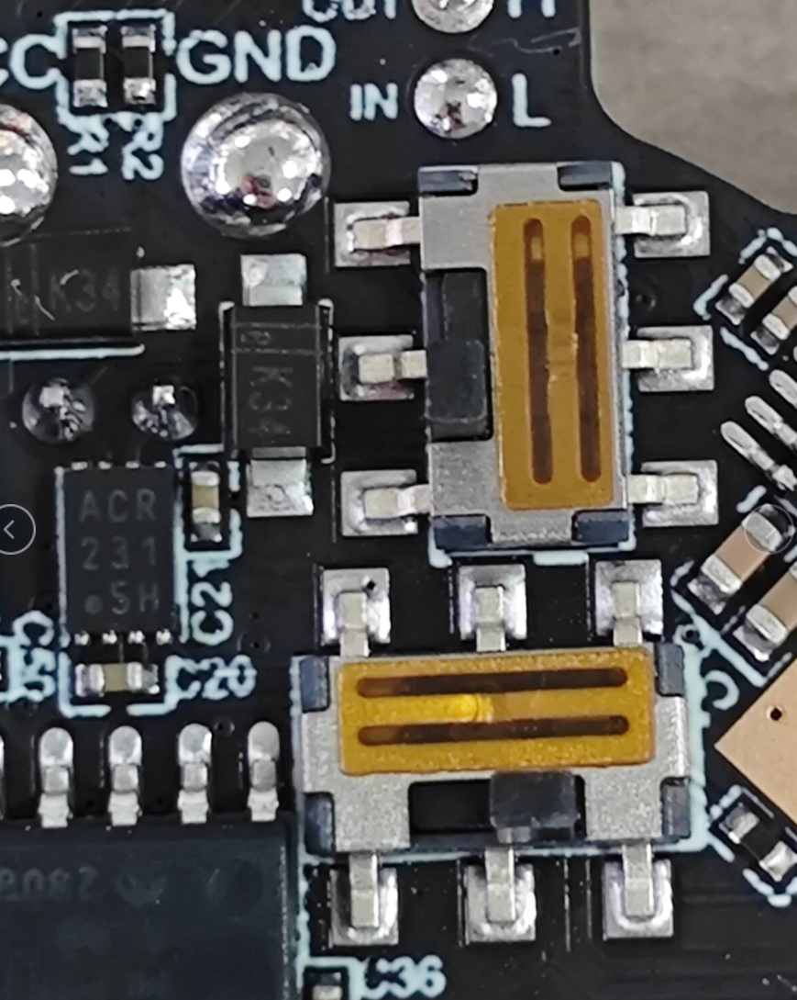
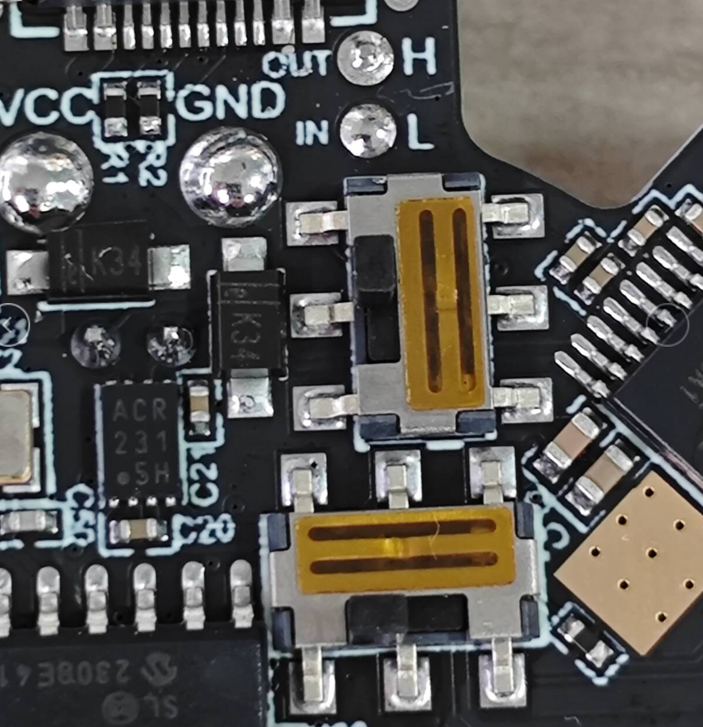
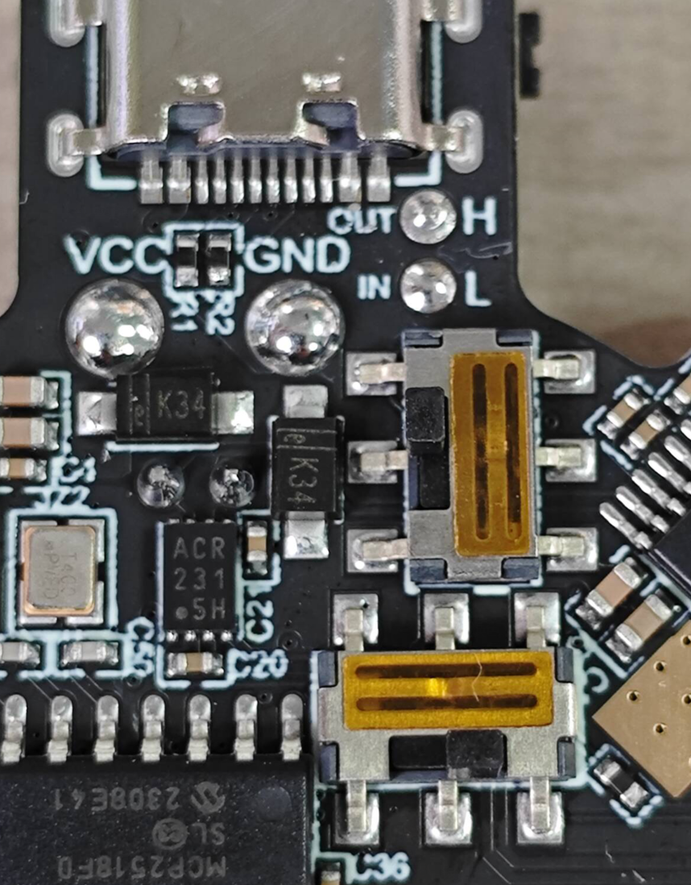

* **请注意SHT36 V3支持三种连接方式需要修改拨码并且烧录固件才可以正常连接**
* **请注意SHT36 V3支持三种连接方式需要修改拨码并且烧录固件才可以正常连接**
* **请注意SHT36 V3支持三种连接方式需要修改拨码并且烧录固件才可以正常连接**

## KLIPPPER使用CAN连接时候请将拨码拨到

**can口旁边拨码朝下拨，中间拨码朝右拨**

## KLIPPER使用RS232连接时候请将拨码拨到

**can口旁边拨码朝上拨，中间拨码朝左拨**

## RRF使用CAN连接时候请将拨码拨到

**左边拨码往上拨，中间拨码往左拨**

