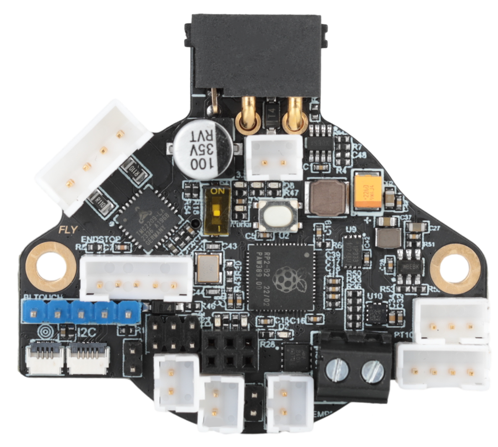

# 1. 产品简介

FLY SHT36 V3是广州镁伦电子科技有限公司针对3D打印机挤出头设计的喷头工具板，使用该工具板，可以用四根线来替代原来主板与打印头之间繁杂的接线，优化布局。SHT36 V3适用于36步进电机，其集成了CAN收发器、RS232收发器、TypeC口、TMC2209驱动、LIS2DW加速度传感器，2个可控风扇等其他功能的工具板。此工具板适用于Klipper与RRF固件。

## 1.1 产品特点

* 预留Boot按钮，用户可通过TypeC进入Boot模式更新固件
* 支持Klipper固件、RRF固件
* 支持CAN模式、RS232模式、RRF CAN模式，
* 在RS232模式下，拥有更高的传输速率、更强的稳定性。在CAN模式下，，支持CAN扩展，预留CAN扩展接口
* 温度传感器支持： 板载MAX31865芯片，兼容PT100和PT1000温度传感器。
* 支持两路可控风扇，电压可选，可替换Mos小板，便于维修替换，最大输出电流可达1A
* 板载LIS2DW加速度传感器与LDC1612传感器（LDC1612只能给rrf使用）
* 预留RGB接口、板载2209驱动，支持多种调平传感器，例如BLtouch、klicky、Voron Tap、PL08n等
* 支持12-24V电压、15A电流输入，增大加热棒端口，额定电流10A

## 1.2 新增功能

* 支持Klipper CAN模式、RS232模式、RRFCAN模式互相切换
* 新增RS232模式，拥有更高的传输速率、更强的稳定性，调试使用也更为简单
* 新增RRF CAN模式，可切换为RRF工具板，增强适用性
* 新增CAN扩展接口，方便扩展CAN设备
* 新增终端电阻拨码开关，其终端电阻120R可通过拨码选择，无需跳线
* 新增3米电源/信号连接线，连接线使用双绞设计，抗干扰性能更强

## 1.3 产品参数

● MCU：Raspberry Pi rp2040，Dual core ARM Cortex-M0+@133MHz

● 连接接口使用XT30(2+2)连接器支持15A电流，峰值30A

● 固件：Reprap/Klipper

● 输入电压：DC12V-24V

● 逻辑电压：DC3.3V

● 板载传感器：LIS2DW与LDC1612

● 加热棒接口: 加热棒（HEAT0），10A

● 扩展接口: RGB，EndStop，PT100/PT1000，XH2.54-2P CAN口

● 风扇接口：两路DC可控风扇

● 电机驱动：板载TMC2209

● 温度传感器：一路100K NTC或PT1000（TH0），一路PT100/PT1000可选

