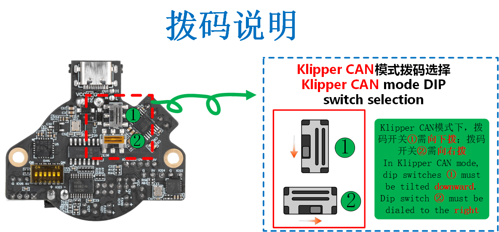
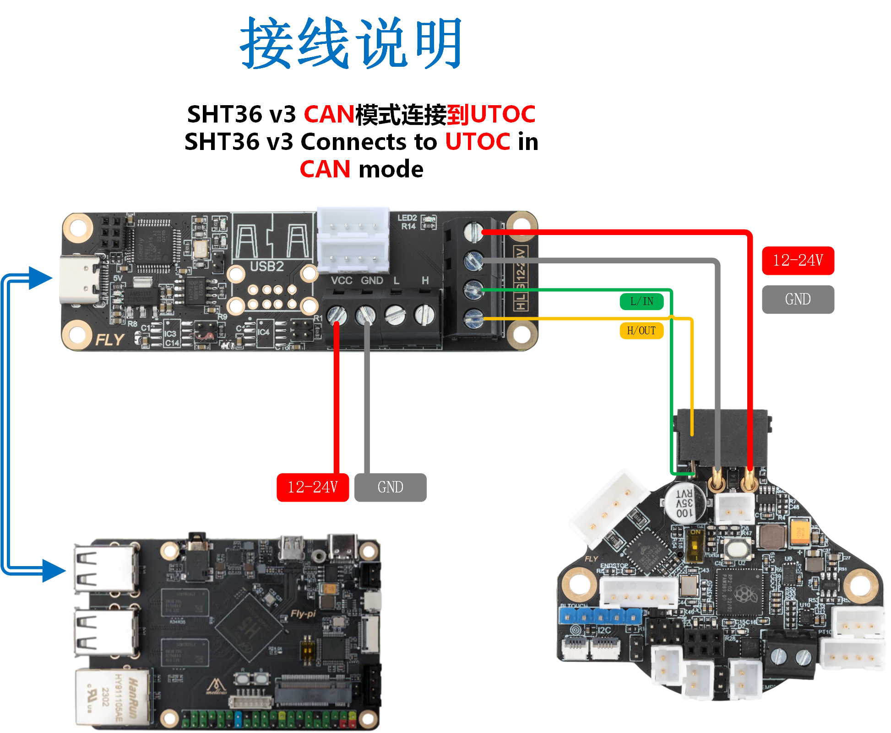
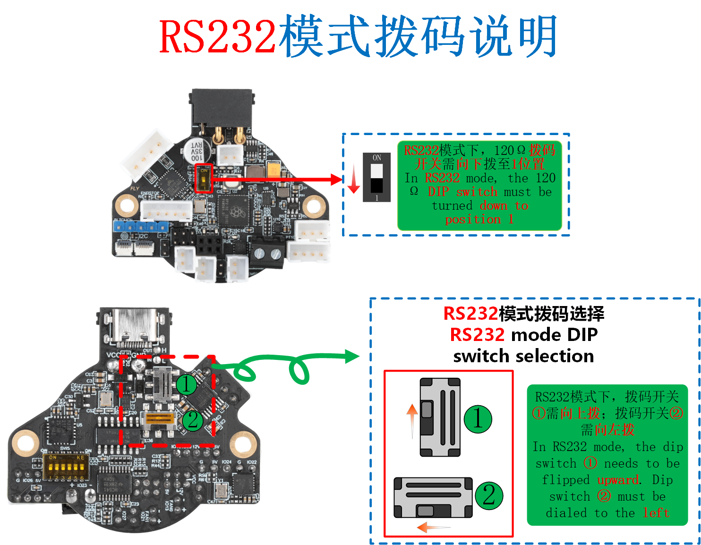

# 

# 4. ID读取

>[!Warning]
>
>搜索ID前请将CAN线接上！！！！

>[!Warning]
>
>搜索ID前确保拨码拨到正确位置！！！！

<!-- tabs:start -->

## **CAN ID读取**

* 请确认拨码在Klipper CAN模式下



> [!TIP]
> [搜索CANuuid](/introduction/id?id=搜索can固件id "点击即可跳转")方法

> [!TIP]
> 已经识别到的CAN ID是不会被查找到的（即已经写入配置文件printer.cfg中的ID，连接成功并正常运行的，是不会被查找到的）

与UTOC连接



* 在SSH中输入下面的命令查找uuid
* 如果你你工具板处于klipper固件下将显示`Application：klippper`
* 如果你你工具板处于canboot固件下将显示`Application：CANBOOT`

```bash
~/klippy-env/bin/python ~/klipper/scripts/canbus_query.py can0
```


出现``Found canbus_uuid=b7c79ec3f948``则查找到设备ID，其中``b7c79ec3f948``为设备UUID。

每一个工具板的CANID都不一样

> [!TIP]
> 如果找不到CAN ID，请检查：

* 接线是否正确，例如CANH 和 CANL是否接反或者接触不良
* SHT36板上的120Ω终端电阻跳拨码是否打开
* 是否正确供电，在刷固件时可以只使用TypeC接口供电
* 您的镜像内核是否支持CAN
* 固件是否编译正确

CAN ID参考配置

```bash
[mcu SHT36V3]
canbus_uuid: b7c79ec3f948     #将读取到的uuid填写到此处
```

## **RS232 ID读取**

* 请注意串口工具板一定要与上位机共地否则无法连接！！！！

* 请确认拨码在RS232模式下



* 与UTOR接线如下


* 上位机连接ssh后输入下方指令搜索设备！！

```
ls /dev/serial/by-path/*
```


* 请注意使用FLY UTOR会输出三个id，但是如果你过另外一个UTOR系统会记录下来导致搜索时候出现多个id
* 请确保id后面带有`-port0`否则无法使用

RS232参考配置

```
[mcu SHT36V3]  # 工具主板序列号
## RS232 ID
## 请根据固件配置填写波特率
serial: /dev/serial/by-path/platform-xhci-hcd.0.auto-usb-0:1.4.2:1.0-port0
baud: 250000
restart_method:command
```

<!-- tabs:end -->


