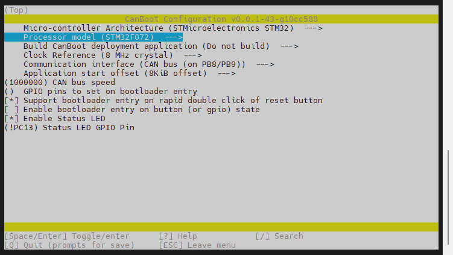
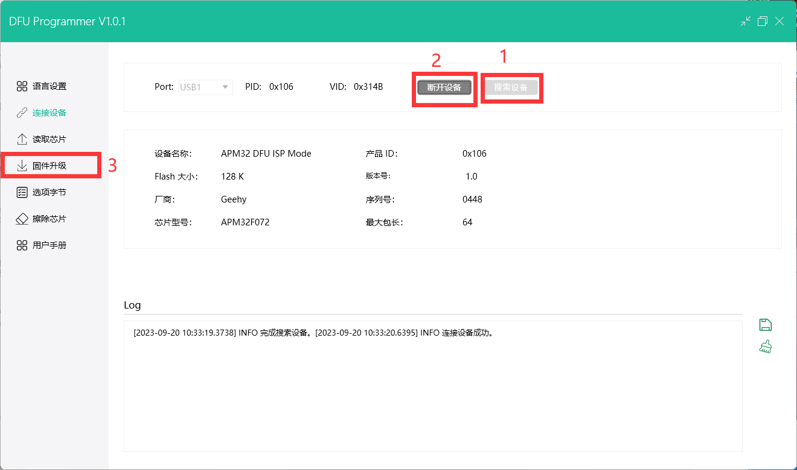
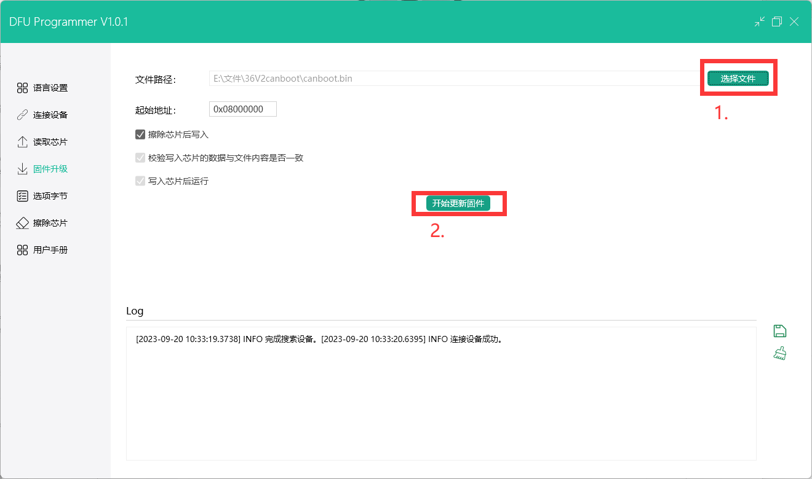

## 编译固件

> [!TIP]
> CanBoot固件默认500k

编译固件前请确保 [连接到SSH](/board/fly_pi/FLY_π_description5 "点击即可跳转")

这里只简要介绍固件编译参数

> [!TIP]
> 固件配置方法只是参考，需要按主板提供配置来配置

**固件配置方法**


1. 进入CanBoot

    ```bash
    cd ~/CanBoot
    ```
    
2. 修改Canboot编译配置

    ```bash
    make menuconfig
    ```

**APM32F072 & STM32F072**



<!-- tabs:end -->

3. 编译

    ```bash
    make -j4
    ```

     最后出现**Creating bin file out/canboot.bin**则编译成功

## STM32F072烧录CANBOOT

> [!TIP]
> 请确定36v2的主控是**APM32F072或者STM32F072**


1. 进入SHT36 V2的USB烧录模式


2. 安装烧录工具

```bash
sudo apt install dfu-util -y
```

3. 使用Type-C数据线将SHT板连接到Linux设备，请确保连接前已安装**短接跳线**

4. 执行下面的命令查看是否连接成功,复制蓝色框中的USB ID

```bash
lsusb
```


5. 烧录固件(烧录前确保已经编译过固件),将下面命令中的**0483:df11**替换为前面复制的USB ID

```bash
dfu-util -a 0 -d 0483:df11 --dfuse-address 0x08000000 -D ~/CanBoot/out/canboot.bin
```

6. 没有报错则烧录成功,如果出现报错请重新检查每个步骤操作


7. 出现上图内容则烧录成功

> [!TIP]
> 注意：烧录成功后一定记得拔下来跳线帽


8. 检查

​    如果正确配置编译并烧录成功，则SHTv2板的这个灯会常亮


## APM32F072烧录CANBOOT

> [!TIP]
> 请确定36v2的主控是**APM32F072或者STM32F072**


1. 进入SHT36 V2的USB烧录模式


2. 使用Type-C数据线将SHT板连接到Windows电脑，请确保连接前已安装**短接跳线**
3. 下载并且安装烧录工具与DFU驱动

```
https://cdn.mellow.klipper.cn/EXE/DFUProgrammer.zip
```

4. 打开DFUProgrammer并且按下方





点击开始更新固件稍等即可，烧录完即可拔掉type-c与跳线帽

5. 重新插入type-c,如果正确配置编译并烧录成功，则SHTv2板的这个灯会常亮

