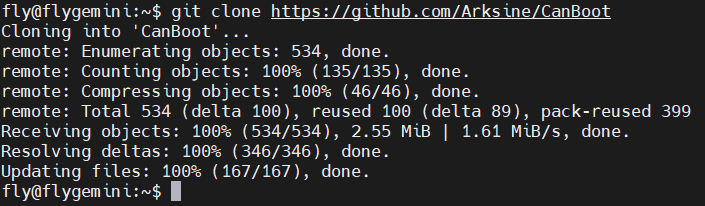

# 4. 固件烧录

> [!TIP]
> SHTV2预装了CanBoot，只支持CAN烧录，烧录前请使用CAN连接到上位机

## 4.1 编译固件

> [!TIP]
> **2023年9月20号之前**CanBoot固件默认500k

>[!TIP]
>**2023年9月20号之后**CanBoot固件默认1M

编译固件前请确保 [连接到SSH](/board/fly_pi/FLY_π_description5 "点击即可跳转")

这里只简要介绍固件编译参数，详细固件编译步骤请查看：[编译klipper固件](/board/fly_super8/firmware?id=_1-编译klipper固件 "点击即可跳转")。 看到第 **13** 步即可！！！

**固件配置方法**

1. 修改klipper编译配置

    ```bash
    cd klipper
    rm -rf .config && make menuconfig
    ```

> [!TIP]
> 注意，在2022-10-18 **前** 购买的主控芯片为GD32F103；在2022-10-18 **后** 购买的主控芯片为APM32F072；在2023-05-01 **后** 购买的主控为STM32F072


> [!TIP]
>
> 注意，在2022-09-20 **前** 购买的SHT36-V2使用的canboot速率为500K；在2022-09-20 **后** 购买的SHT36-V2使用的canboot速率为1M


<!-- tabs:start -->

#### ****GD32F103****


#### ****APM32F072 & STM32F072****


<!-- tabs:end -->

3. 编译

    ```bash
    make clean
    make -j4
    ```
    
     最后出现**Creating hex file out/klipper.bin**则编译成功

## 4.2 查找uuid

> [!TIP]
> 请使用UTOC或者其他支持klipper USB桥接CAN的主板将SHTV2与上位机通过CAN总线连接

> [!TIP]
> 如果已经烧录过klipper并且在正常运行，可跳过查找uuid，使用配置文件中的uuid进行烧录

> 由于SHTV2预装了CanBoot，只支持CAN烧录，因此在固件烧录前需要读取uuid后才能烧录固件

首先进入ssh，然后依次输入以下指令

```
cd
git clone https://github.com/Arksine/CanBoot
```



```bash
python3 ~/klipper/lib/canboot/flash_can.py -q
```

请注意，搜索到id后是显示``Application: Canboot``前面才是工具板id


下图中高亮部分``365f54003b9d``就是这块SHTv2板的uuid，这个uuid每块板子都不一样。同一块SHTv2板烧录固件后uuid是不会变的


> [!TIP]
> 如果找不到CAN ID，请检查：

* 接线是否正确，例如CANH 和 CANL是否接反或者接触不良
* SHT36 V2板上的120Ω跳线帽是否插上
* 您的镜像内核是否支持CAN

如果确认没有上述问题，则可以尝试在**通电状态**下强制进入CanBoot来解决。此方法也可以在刷错固件连不上工具板之后尝试。进入CanBoot的方法如下，请小心使用！！！以免损坏SHT工具板！！！


如果成功进入Canboot，下图中的LED灯会以一定的频率闪烁


## 4.3 烧录固件

将下面命令中的``365f54003b9d``替换为[查找uuid](#_2-查找uuid "点击即可跳转")中查找到的uuid

```bash
python3 ~/klipper/lib/canboot/flash_can.py -u 365f54003b9d
```

如下图，出现``CAN Flash Success``则烧录成功


3. 检查

    如果正确配置编译并烧录成功，则SHTv2板的这个灯会常亮

