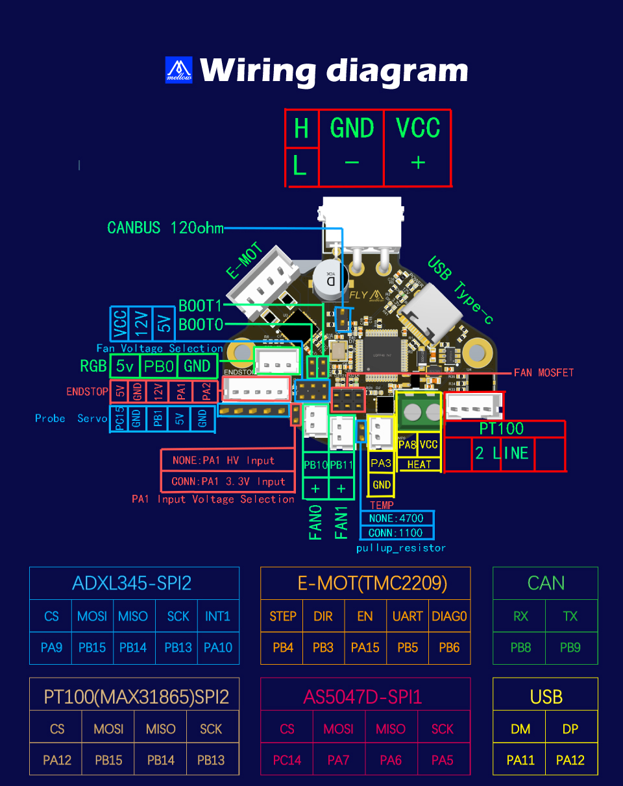

# SHT36 v2接线

?>赠送的蓝色散热片，请粘贴到2209驱动上！！！

## 2.1 接线图



## 2.2 终端电阻配置

?> 使用CAN之前，请正确配置CANBUS终端电阻。

* CANBUS总线协议一条总线中必须且只能有两个120欧姆电阻
*  不管你连接几个USB设备，只要是在一条总线就只配置两个120欧姆电阻。不用为每个设备加一个电阻
* 在接好CAN H和CAN L信号线之后，使用万用表测量CAN H与CAN L，两者之间的阻值应约为60欧姆


## 2.3 电源接线

* SHTv2的线材颜色

| 颜色 | 功能                 |
| :--: | :------------------- |
| 红色 | ***直流12/24v输入*** |
| 黑色 | ***直流负极(GND)***  |
| 黄色 | ***CAN H***          |
| 白色 | ***CAN L***          |


## 2.4 风扇MOS

风扇mos不分正反，插稳即可


## 2.5 加热棒接线

加热棒支持最大10A的电流，使用时请注意加热棒的功率！


## 2.6 热敏接线

下图为普通热敏和**PT1000**的接线方法。


下图为**PT100**的接线方法。默认两线PT100，只需连接到从左至右第2、3个引脚即可。


## 2.7 风扇接线

SHT36 v2支持最多两个可控风扇，接线方法如下。

?>  通电前请选择风扇电压，否则风扇不能正常工作！！！


## 2.8 RGB接线

RGB灯珠的正负极千万不能接反，否则会损坏CAN工具板。


## 2.9 挤出机接线

挤出机接线完成后，请注意配置好驱动电流，校准好挤出机电机转向。


## 2.10 限位开关

限位开关有常开（NO）和常闭（NC）两种。一般在3D打印机上，建议使用常闭（NC）， 这样在限位开关线路出现问题时，系统会及时报错，可以避免一些不必要的撞车，避免损坏 打印机。

如果为VORON机型，可以考虑更换限位的安装位置，在打印头滑车上安装X限位开关，A电机座上安装Y限位开关。另外，在SHT36上，建议限位开关前最好加上``^``，将信号上拉。例如：

```
[stepper_x]
endstop_pin: ^sht36v2:PA2  # 在前面加上^,将信号上拉，特别是在使用PA1时，请务必加上上拉 ^
```


##  2.11 调平传感器接线

### 2.11.1 接近开关

VORON 官方建议是使用欧姆龙 Omron TL-Q5MC（之前官方推荐的是 PL08N，两者原 理一样，只是探测距离不一样）传感器来进行热床调平。


### 2.11.2 Klicky

Klicky 为第三方的调平传感器，能够用极低的成本自己在家制作，且性能稳定，性价比非常高，推荐使用。接线方法如下图所示。


### 2.11.3 Voron Tap

Voron Tap为Voron团队最新发布的调平传感器方案，有着精度高，稳定性强，适应性好等特点。接线时，请注意正负极不能接反，否则会损坏Tap传感器甚至SHT工具板。

?> Voron Tap不建议接 **24V** ，某些版本使用 **24V** 有一定概率会导致Tap传感器烧坏，这并非Fly产品的问题，是Voron Tap的设计缺陷，请悉知！！！


### 2.11.4 Bltouch

BL-touch 一共有五根线，三根为第一组，负责传感器的供电和探针的收放，第二组为地线 和信号线，输出限位信号。BL-touch 接线时请仔细核对接线顺序，错误的接线可能会永久性损坏 传感器和主板！！！接线方法如下图所示。


## 2.12 SHT36   v2连接UTOC

FLY UTOC是一款USB转CAN总线的模块，通过它将FLY π的USB端口专为CAN总线，通过CAN总线连接3D打印主板、SHT36v2等CAN总线产品。FLY UTOC板上拥有多种端子接口，使用灵活性好，可以适配不同的使用场景。**另外，UTOC在出厂时已经刷好固件，到手即用，无需再刷写固件。**


**USB-IN:** USB转CAN输入接口，连接到上位机

**12-24v & GND:** 电源接口

**CANBUS:** CAN接口，连接到扩展主板和工具板等(连接到有板载CAN收发芯片的设备)

**CANBUS\*:** CAN接口，连接到扩展主板和工具板等(仅限连接到STM32设备的USB接口[PA11,PA12],请注意购买相应版本的UTOC)


