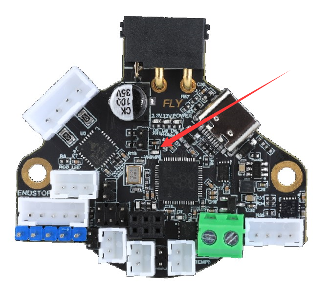
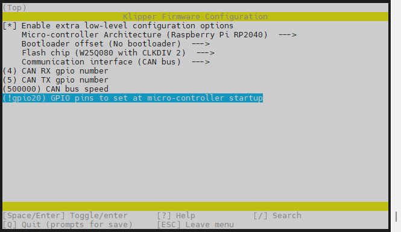
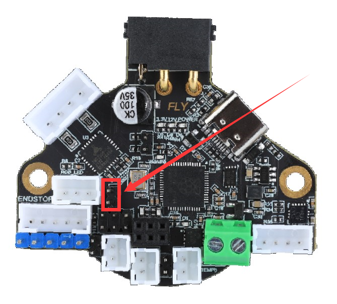

# 4. 固件烧录

> [!TIP]
> SHT36预装了CanBoot，支持CAN烧录，烧录前请使用CAN连接到上位机；也可以使用Type-C数据线连到到上位机，使用USB烧录
>
> 请注意 canboot默认速率为500k

## 4.1 编译固件

编译固件前请确保 [连接到SSH](/board/fly_pi/FLY_π_description5 "点击即可跳转")

这里只简要介绍固件编译参数，详细固件编译步骤请查看：[编译klipper固件](/board/fly_super8/firmware?id=_1-编译klipper固件 "点击即可跳转")。 看到第 **13** 步即可！！！

**固件配置方法**

1. 确保使用最新的klipper

    ```bash
    cd && cd ~/klipper
    ```
    
2. 修改klipper编译配置

    ```bash
    rm -rf .config && make menuconfig
    ```

    配置如下图

    

<!-- tabs:start -->

### ****FLY-SHT36-LIS3DH-使用CANBOOT烧录****

**感叹号是英文否则会编译错误**

**使用CANBOOT烧录时编译此固件**


```
make clean
make -j4
```

 使用usb烧录的固件最后出现**Creating uf2 file out/klipper.bin**则编译成功

> [!TIP]
> 请使用UTOC或者其他支持klipper USB桥接CAN的主板将SHT与上位机通过CAN总线连接

> [!TIP]
> 如果已经烧录过klipper并且在正常运行，可跳过查找uuid，使用配置文件中的uuid进行烧录

> [!TIP]
>
> 由于SHT预装了katapult，只支持CAN烧录，因此在固件烧录前需要读取uuid后才能烧录固件

> [!TIP]
>
> 请注意 canboot默认速率为500k

首先进入ssh，然后依次输入以下指令

```
cd && git clone https://github.com/Arksine/katapult
```


```bash
python3 ~/klipper/lib/canboot/flash_can.py -q
```

下图中高亮部分``365f54003b9d``就是这块SHT板的uuid，这个uuid每块板子都不一样。同一块SHT板烧录固件后uuid是不会变的


1. 将下面命令中的``365f54003b9d``替换为[查找uuid](#_2-查找uuid "点击即可跳转")中查找到的uuid

```bash
python3 ~/klipper/lib/canboot/flash_can.py -u 365f54003b9d
```

2. 如下图，出现``CAN Flash Success``则烧录成功

出现下图则烧录成功


> [!TIP]
> 如果找不到CAN ID，请检查：

* 接线是否正确，例如CANH 和 CANL是否接反或者接触不良
* SHT36 加速度计不能用板上的120Ω跳线帽是否插上
* 您的镜像内核是否支持CAN

如果确认没有上述问题，则可以尝试在**通电状态**下强制进入CanBoot来解决。此方法也可以在刷错固件连不上工具板之后尝试。进入CanBoot的方法如下，请小心使用！！！以免损坏SHT工具板！！！

如果成功进入Canboot，下图中的LED灯会以一定的频率闪烁



​    

### ****FLY-SHT36-LIS3DH-使用USB烧录****

**感叹号是英文否则会编译错误**

**使用USB烧录时编译此固件**




```
make clean
make -j4
```

 使用usb烧录的固件最后出现**Creating uf2 file out/klipper.uf2**则编译成功

**使用Type-C烧录固件**



**短接跳线插上type-c到电脑会弹出RPI-RP2**

**弹出RPI-RP2后不需要在短接rst**


**把klipper.uf2放进去，弹窗会关闭**

<!-- tabs:end -->

### 刷完固件后 这个led会常亮


