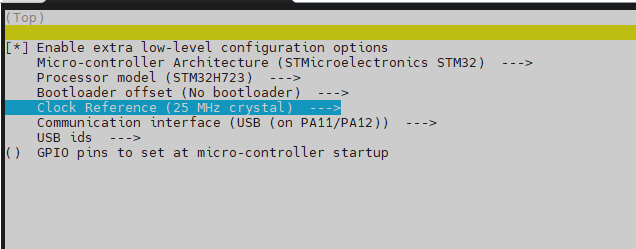
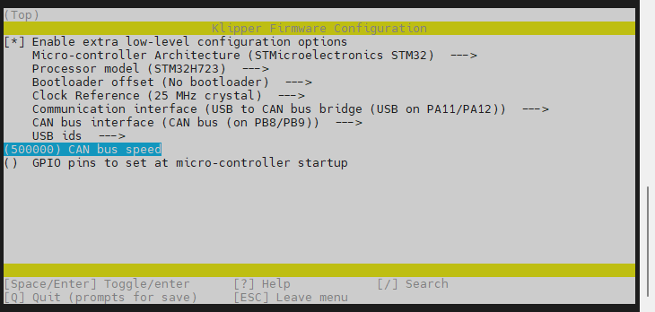
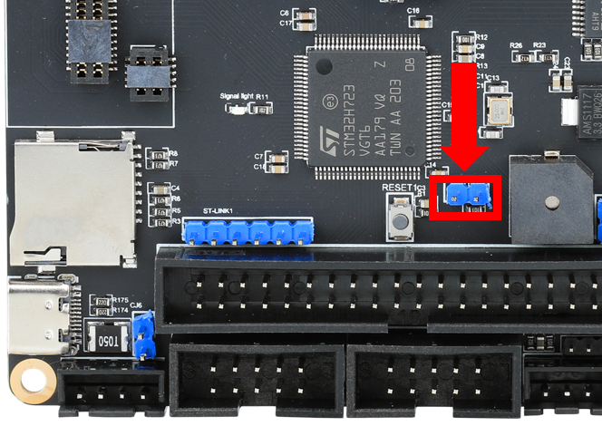

# 固件烧录

**固件配置方法**

## 编译固件

<!-- tabs:start -->

### ****H723USB固件****



### ****H723CAN桥接固件****

>[!TIP] 
>
>此方法是通过主板桥接CAN设备，请确保上位机的can0、桥接主板的CAN速率、CAN工具板的速率完全一致



<!-- tabs:end -->

* 如何编译固件参考[固件烧录](/introduction/firmware)

## 烧录固件

### USB烧录

> [!TIP]
> Super5需要按下图所示，在**主板断电状态**下插入跳线帽来进入DFU模式，使用USB口进行线刷。



<!-- tabs:start -->

### **方式一：Klipper上位机烧录**

1. 安装烧录工具

```bash
sudo apt install dfu-util -y
```

2. 使用Type-C数据线将Super5板连接到Linux设备，请确保连接前已安装短接跳线
3. 执行下面的命令查看是否连接成功,复制蓝色框中的USB ID

```bash
lsusb
```


4. 烧录固件(烧录前确保已经编译过固件),将下面命令中的**0483:df11**替换为前面复制的USB ID

* 请注意加入sudo后需要输入你当前用户的密码，并且密码看不到

```bash
dfu-util -a 0 -d 0483:df11 --dfuse-address 0x08000000 -D ~/klipper/out/klipper.bin
```
5. 没有报错则烧录成功,如果出现报错请重新检查每个步骤操作


6. 出现上图内容则烧录成功

### **方式二：电脑USB烧录**

1. 下载烧录工具[STM32CubeProgrammer](https://cdn.mellow.klipper.cn/Utils/STM32CubeProgrammer.zip)
2. 解压烧录工具到任意目录，进入`STM32CubeProgrammer/bin`目录，双击打开`STM32CubeProgrammer.exe`
3. 将前面编译好的固件(klipper.bin)复制到电脑任意目录
4. 使用Type-C数据线将Super5板连接到电脑，请确保连接前已安装短接跳线
5. STM32CubeProgrammer中选择USB模式，并刷新，连接


6. 如果没有出现错误弹窗则连接成功
7. 打开固件文件，在弹窗中选择前面编译完成的固件文件(klipper.bin)


8. 确认页面有内容，不是00000。然后点击**Download**


9. 出现图中就是烧录成功


<!-- tabs:end -->

>[!TIP] 
>
>注意：烧录成功后一定记得拔下来跳线帽