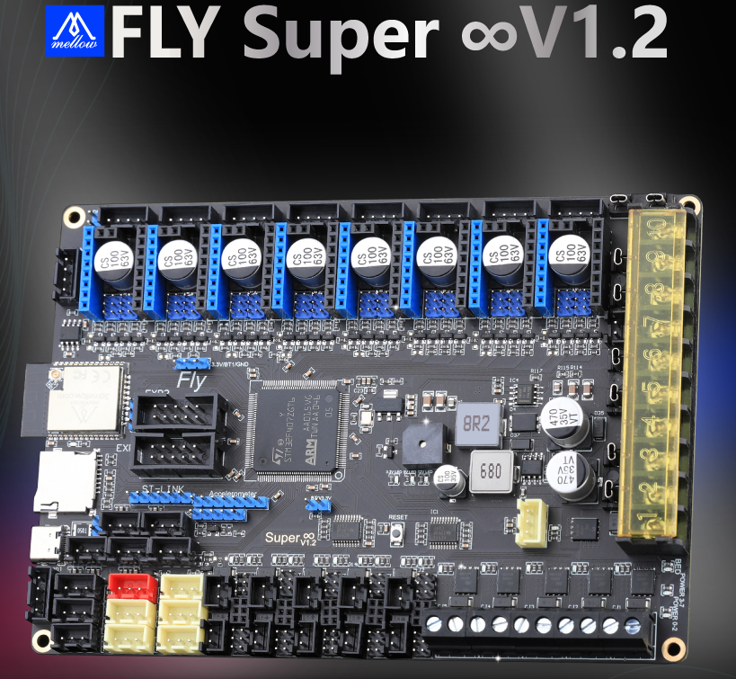

# 产品简介

Mellow Fly Super8是广州镁伦电子科技有限公司Fly3D主板研发团队推出的一款可以最多支持8路步进电机的3D打印机主板。

* 32位ARM Cortex-M4系列168 MHz，STM32F407ZGT6芯片
* 固件：Marlin 2.0/Reprap/Klipper
* 驱动支持：A4988、LV8729、DRV8225、TMC2208/2209/5160等
* 驱动模式支持：TMC：UART/SPI
* 8个高压驱动位、支持8个独立电机驱动、5个挤出机、10个PWM风扇
* 显示：串行触摸屏、mini12864 LCD、12864 LCD、2004 LCD、FLY 4.3/7.0 V1
* 1个高压IN口，支持自动平床传感器：BLTouch、PL08N等接近传感器、Klicky、Voron Tap等
* 可选限位开关电源：5V/12V/24V
* 使用repap固件，可以使用板载ESP32 WiFi模块，支持1.6m/s
* 独特的PWM Fan MOS板设计，损坏可直接更换，降低客户维修难度，两个2pin风扇接口可支持4pin PWM风扇
* PCB采用2OZ铜厚，能够支持更大的电流
* 6个ADC接口，最多支持六路热敏
* 8个IO接口，可以用于调平和限位
* 5个加热棒接口，最多支持五路加热棒
* 2个PMW接口

## 产品详情

淘宝：[Fly3D Super8轴3D打印机主板RRF/marlin/Klipper固件VzBoT Voron-淘宝网 (taobao.com)](https://item.taobao.com/item.htm?spm=a1z10.5-c-s.w4002-23066022675.18.68de3903lHTcFZ&id=654767618383 "点击即可跳转")

## Super8主板升级说明

  * Super8 1.1：修复CAN芯片供电
  * Super8 1.2：增加DIAG7的跳线（DIAG7和高压限位共用，避免客户使用高压时不剪驱动引脚导致烧驱动）
  * Super8 1.3：WiFi模块升级为可拆卸模块（Klipper和Marlin固件不需要使用到Super8的WiFi模块）

----

?> 重要

* 非FLY上位机请按[CAN使用](/advanced/can_rpi.md)文档配置好CAN
* 使用CanBoot请查看[CanBoot使用](/advanced/canboot.md)