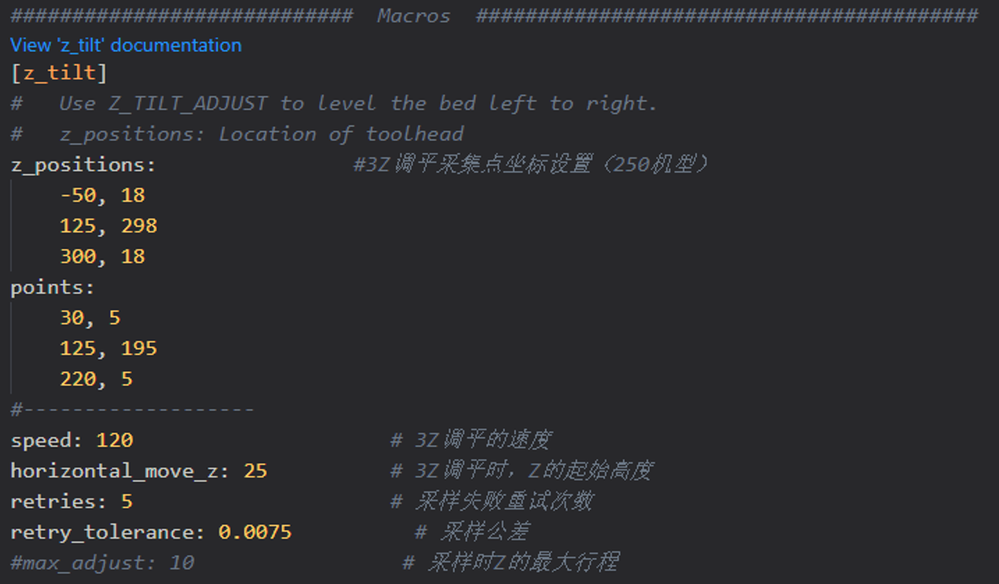
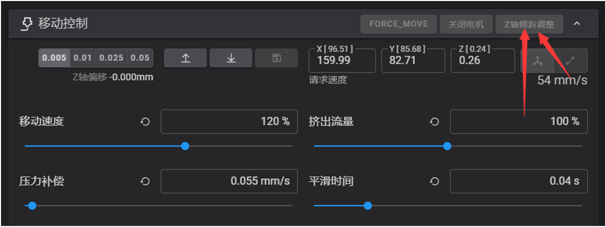
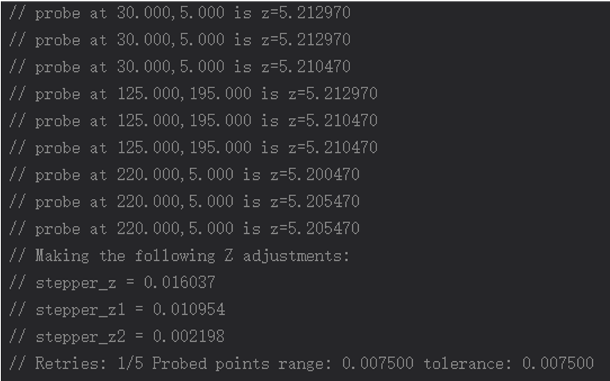
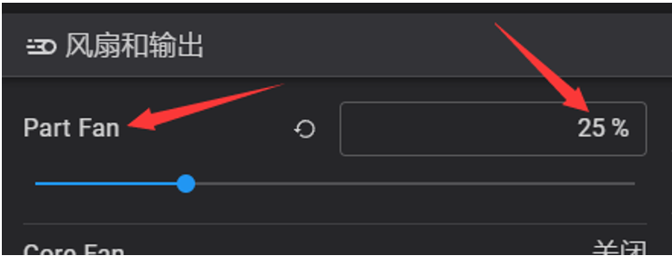
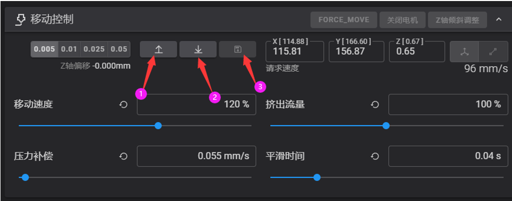
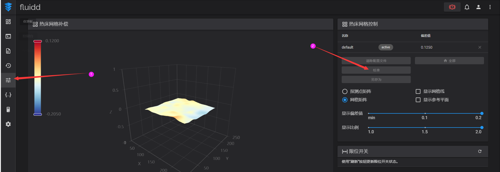
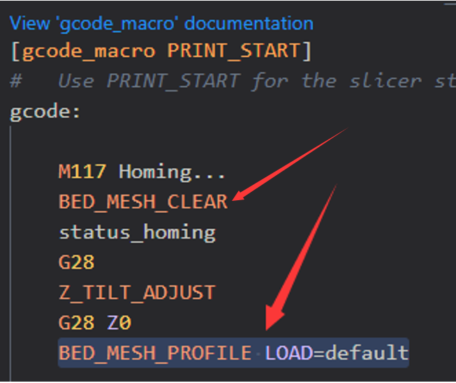

# 打印前的准备

## 1.1 热床调平

在进行三轴调平之前，先打开printer.cfg，找到3Z调平的宏 [z_tilt]，根据热床的大小调整3个探测点的位置，确保探测点都在热床的打印范围内。



在第一次运行3Z调平之前，请先用手将热床平台的三个角的高度调到差不多一致，然后运行一次``全部归位``，然后再点击“Z轴倾斜校准”。



打印机开始执行3Z自动调平动作，喷头从左下角开始采集高度数据，并按顺时针依次探测完3个点。每次探测完，系统会自动计算出一个平均的公差值，并自动调整3个角的高度。重复探测2-3次，直至公差值小于 ``retry_tolerance: ``的设定值，即完成了3Z调平的动作。



?> **注意：**如果偏差越来越大，请检查是电机的顺序是否正确。如果探测次数超过5圈仍未达到预设公差，系统将会报错。Z轴丝杆和电机的安装情况以及劣质的传感器都会影响重复探测的精度。

## 1.2 热床PID校准

在归位完成后，将z轴平台下降5-10mm，然后发送命令：``PID_CALIBRATE HEATER=heater_bed TARGET=100``

命令发送后，系统会自动执行一个PID校准的程序，以校准热床的PID。整个过程会持续大约十分钟。

完成后，发送保存命令：``SAVE_CONFIG``  这条命令会自动把参数保存到配置文件中。

## 1.3 喷头PID校准

首先将模型冷却风扇设置为25%的转速。



然后发送命令：``PID_CALIBRATE HEATER=extruder TARGET=245``

命令发送后，系统会自动执行一个PID校准的程序，以校准喷头的PID。整个过程会持续大约五分钟。

完成后，发送保存命令：``SAVE_CONFIG``  这条命令会自动把参数保存到配置文件中。

## 1.4 Z偏移校准

对Z偏移的调整，其实就是是调整Z轴在高度为0时，喷嘴距热床的高度，他关系到打印时，首层的高度是否正确，耗材是否能良好的粘附在热床上（使用klicky的自动Z偏移则不需要执行此项操作）。在做此项操作前，请将挤出机设置为240℃，热床加热至100℃，预热15分钟后开始以下操作。

1. 点击控制台上的“全部归位”。

2. 将打印头移动到热床中心，运行命令： ``Z_ENDSTOP_CALIBRATE  ``  ,Voron Tap则运行命令：``PROBE_CALIBRATE``

然后使用命令：``TESTZ Z=-1`` 缓慢的将热床平台向喷头移动，直至喷头离热床表面约1mm时，在热床与喷头之间垫一张A4纸，然后使用命令：``TESTZ Z=-0.1`` 使热床慢慢靠近喷头表面，直至热床轻轻接触到A4纸，如果用手抽拉白纸时有轻微阻力，此时可以执行命令：``ACCEPT``，然后执行命令：``SAVE_CONFIG``，系统会自动把刚刚测试的参数保存到配置文件中。此测试建议执行2-3此，以达到最佳效果。

如果在测试过程中，喷头下降太多，导致A4纸抽拉不动，可以使用整数``TESTZ Z=0.1``，使喷嘴抬高。

注意，保存完参数后，请立即在控制台中下降z轴，使热床平台原理喷头，以免烫坏PEI弹簧钢板。

如果在执行过程中出现报错(越界)，一般是由于Z限位传感器的轴太长，可能会在打印过程中卡住打印头或刮擦PEI。可以选择切割限位开关的轴或者垫高铝板，使其与 PEI 的表面平齐。

## 1.5 动态微调Z高度

在打印过程中，可以使用控制页面上的Z偏移微调按钮来动态调整喷嘴的高度，使首层打印效果更好。打印完成后，可以点击旁边的保存按钮，系统会自动保存刚刚动态微调的参数，当前的微调偏移值会累加到原有的偏移值上。



## 1.6 在加热时调平

第一次在封箱里运行热床调平时，需要验证调平传感器的稳定性。

1.首先加热喷头和热床，热床设置为100℃，喷头设置为240℃。

2.预热约15-20分钟后，将喷头移动到热床中心，运行``PROBE_ACCURACY``。如果探测数值呈上升或下降趋势，或者偏差值大于0.003mm，请等待几分钟后再次尝试。需要读数稳定后，才能执行调平命令。

?> **注：**因为热床铝板在加热过程中会存在热变形，每次开始打印时需要先从冷机预热10-20分钟，以确保温度稳定下来，热床加热变形稳定后，再执行打印工作

## 1.7 网床补偿

网床补偿的配置如下，请根据自己的热床大小来修改相应的配置。网床补偿前，建议将热床预热到打印温度10~20分钟后再开始探测。

```
[bed_mesh]             # 网床补偿
speed: 120			  # 探测速度
horizontal_move_z: 5   # probe触发后，热床平台下降的距离
mesh_min: 40, 40       # 网探测的起始位置（修改此处）
mesh_max: 210,210      # 探测的结束位置（修改此处）
probe_count: 10,10     # 网床补偿探测点数（根据自己的实际使用需求来修改）
mesh_pps: 2,2
algorithm: bicubic
relative_reference_index: 12

```

找到调整选项，然后点击校准，系统会自动执行网床校准。命令执行完成后，在控制台输入：``SAVE_CONFIG`` 命令，系统会自动保存探测的参数。



使用网床补偿时，请在``printer.cfg``中的``[PRINT_START]``宏中添加命令：``BED_MESH_PROFILE LOAD=default``（如果网床数据是自定义的名称，那么请将default修改为自定义的名称）。

同时，请在``[PRINT_START]``宏中的热床调平命令前添加命令：``BED_MESH_CLEAR``



## 1.8 挤出机校准

### 1.8.1 挤出方向校准

加热喷头至180°，将耗材丝插入挤出机中，在控制台发送挤出命令，观察耗材的运动方向。如果耗材是向后退的，则需要反转挤出机方向引脚。

```
[extruder]                          # 挤出机
...
dir_pin: PG0                        # 修改前
dir_pin: !PG0                       # 修改后 
...
```

### 1.8.2 挤出长度校准

在第一次打印之前，需要确保挤出机能挤出正确长度的材料。根据打印材料所需的温度，加热挤出头， 从挤出机进料口的铁氟龙管口处量120mm料丝，并在120mm处用美工刀做一个标记。在Fluidd中，手动操作挤出50mm2次，共100mm（Klipper的单次挤出量不允许超过50mm）。待挤出机停止后，测量 从挤出机进料口到标记处的长度x。如果挤出量正确的时候，x应该为20mm（120mm - 100mm = 20mm）。但实际是会有偏差的，找到配置文件中的现有挤出值，并使用以下方法更新它。

```
[extruder]                          # 挤出机
...
##	执行挤出机校准时，更新以下值
##	比如你要求100毫米的进料，但实际上是98毫米：
##	新值=旧值 x（实际挤出长度/目标长度）
##  22.6789511是我们推荐的一个数值
rotation_distance: 22.6789511       # 步进值-Bondtech 5mm 驱动齿轮
# 调整传动比
gear_ratio: 50:17                   # BMG 传动比，如果为orbiter系列挤出机，请注释掉此项
...
```


``新收缩值=旧收缩值*（实际挤出量/目标挤出量）``

将新值替换配置文件中，保存并重启klipper。然后按上述方法重新再验证一遍，如果挤出量在目标值的 ±0.5%范围内（即目标值为99.5-100.5mm，目标挤出长度为100mm），挤出机就校准好了。

## 1.9 切片

切片软件和切片参数请按照个人喜好自行配置。切片完场后，上传至打印机即可开始打印。

