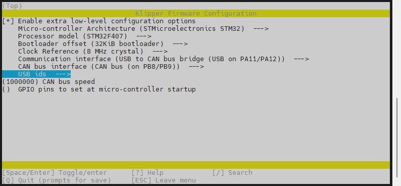
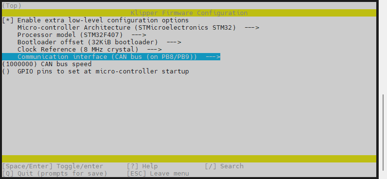

# 2. 固件烧录

> 烧录固件之前确保已完成[FLY π系统镜像](/board/fly_pi/mirror/FLY_π_mirror.md "点击即可跳转")文档

## 2.1 固件参数配置

<!-- tabs:start -->

### ****USB 的固件配置****


### ****CAN桥接固件****

>[!TIP]
>此方法是桥接工具板的配置，请确保工具板CAN速率与上位机的CAN速率完全一致



### ****CAN固件****

>[!TIP]
>此方法需要将主板的CAN口接到UTOC才可以找到CANid




<!-- tabs:end -->

执行下方命令进行固件编译

```
make -j4
```


## 2.2 下载Klipper固件

* 使用软件**WinSCP**


* 第一次登录会出现确认弹窗，点击是或者直接回车即可
* 进入**klipper**文件夹


* 进入**out**文件夹


* 直接将**klipper.bin**拖拽到电脑桌面或其他文件夹即可


## 2.3  烧录固件到主板

1. 准备一张SD卡(<32GB)，并且格式化成 **FAT32** 格式
2. 将klipper.bin复制到SD卡，并且重命名为```firmware.bin```


3. 主板断电，将SD卡插入主板
4. 给主板上电，等待10秒左右
5. 取下SD卡，插入电脑。如果SD卡中的看``firmware.bin``消失，出现```FLY.CUR```就是烧录成功了

