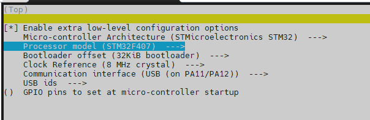
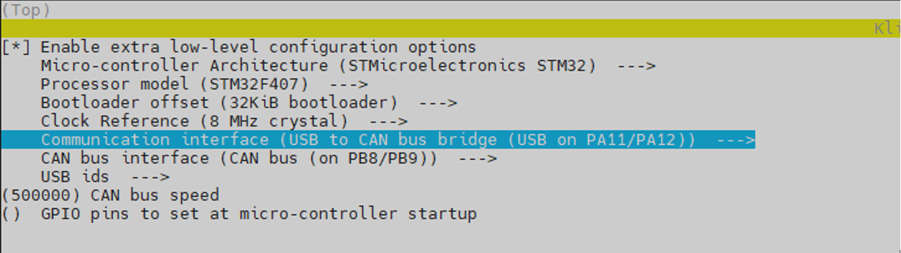
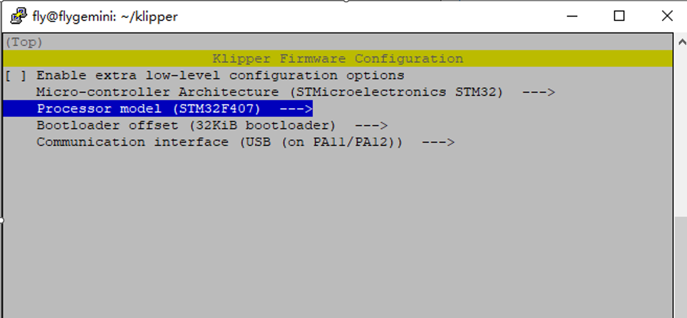

# 2. 固件烧录

> 烧录固件之前确保已完成[FLY π系统镜像](/board/fly_pi/mirror/FLY_π_mirror.md "点击即可跳转")文档

## 2.1 固件参数配置

<!-- tabs:start -->

### ****USB 的固件配置****



### ****CAN桥接固件****

>[!TIP]
>此方法是桥接工具板的配置，请确保工具板CAN速率与上位机的CAN速率完全一致



### ****CAN固件****

>[!TIP]
>此方法需要将主板的CAN口接到UTOC才可以找到CANid


<!-- tabs:end -->

## 2.2 编译Klipper固件

1. 请先阅读[连接到SSH](/board/fly_pi_v2/to_ssh "点击即可跳转")文档
2. 连接到SSH后输入```cd ~/klipper/```回车
3. 按顺序执行下面的命令，输入命令后需要回车才会执行
4. ```make clean```
5. ```rm -rf .config && make menuconfig```
6. 现在应该出现了Klipper编译配置界面


* 上下键选择菜单，回车键确认或进入菜单
7. 进入菜单**Micro-controller Architecture**


8. 选择**STMicroelectronics STM32**回车


9. 进入菜单**Processor model**，选择**STM32F407**回车
10. **Bootloader offset**如果是(32KiB bootloader)则不修改
11. **Communication interface**是USB (on PA11/PA12)
* 配置好后是这样的



12. 按```Q```键，出现**Save configuration**，这时再按```Y```键
* 现在应该保存了配置并且退出到了命令行界面

13. 输入```make -j4```开始编译，时间有点长

* 出现下图则编译成功


14. 下载固件到电脑

* 使用软件**WinSCP**


* 第一次登录会出现确认弹窗，点击是或者直接回车即可
* 进入**klipper**文件夹


* 进入**out**文件夹


* 直接将**klipper.bin**拖拽到电脑桌面或其他文件夹即可


## 2.3  烧录固件到主板

1. 准备一张SD卡(<32GB)，并且格式化成 **FAT32** 格式
2. 将klipper.bin复制到SD卡，并且重命名为```firmware.bin```


3. 主板断电，将SD卡插入主板
4. 给主板上电，等待10秒左右
5. 取下SD卡，插入电脑。如果SD卡中的看``firmware.bin``消失，出现```FLY.CUR```就是烧录成功了

