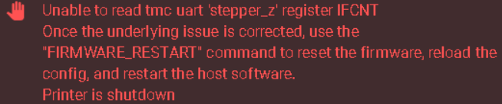
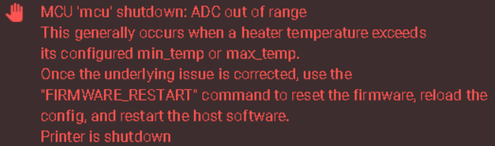

# 7. Klipper常见错误

## 7.1 TMC UART&SPI Error

当TMC驱动程序和Super8主板之间的通讯失效时，就会出现这种情况。引起上述故障。常见的情况有如下几种

* 没有给主板提供24V供电
* 没有正确插上驱动UART跳线帽或者驱动跳线帽配置错误
* 驱动损坏，无法正常使用
* 驱动UART与CS配置错误

## 7.2 ADC out of range

ADC是 "模数转换器 "的缩写，用于将热敏电阻读数转换为挤出头和热床的温度。作为一种安全预防措施，一旦Klipper检测到温度超过最大或最小阀值（热敏电阻可能开路或者短路），系统将报错，进入保护模式。如出现这样的报错，请仔细检查，确保热敏电阻接线正确，热敏电阻引脚配置正确。

## 7.3 Currently Throttled

FLY π或者树莓派供电不足或电压不稳时，将会有如下报错，需更换更粗的电源线或者更换更大功率的电源。

