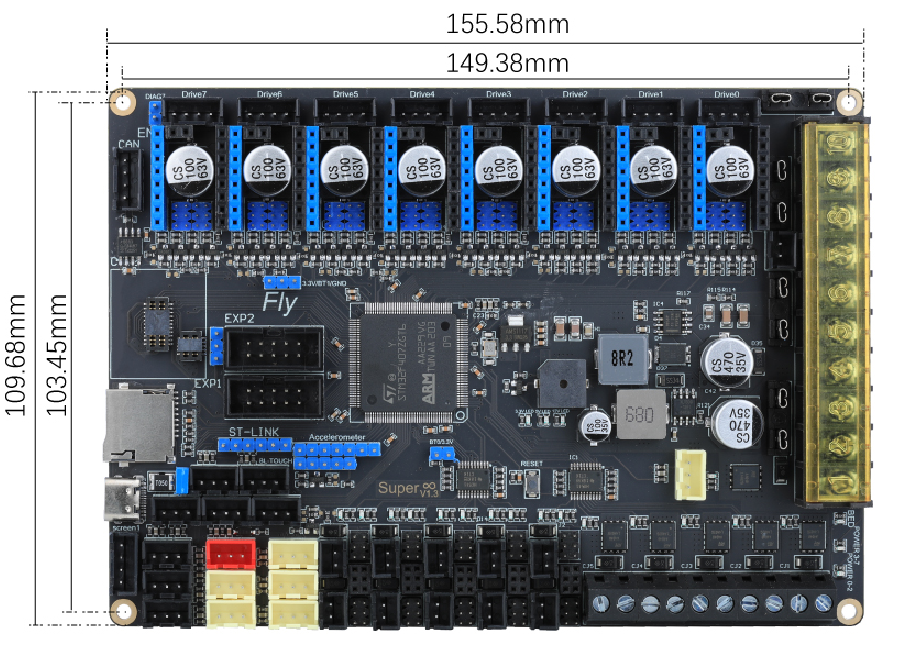

# 1. 产品简介

Mellow Fly Super8-Pro是广州镁伦电子科技有限公司Fly3D主板研发团队推出的一款可以最多支持8路步进电机的3D打印机主板。

* MCU: STM32H743
* 支持CANFD
* 板载ESP32WIFI模块，RRF固件传输速率最大2.43Mbytes/S
* 8个高压驱动位
* PCB采用2OZ铜厚，大电流支持
* 10个可控风扇，可插拔MOS
* 6个ADC接口
* 8个IO接口
* 2个PMW接口
* 1个高压IN口
* 5个加热棒接口

## 1.1 产品详情

淘宝：[Fly3D Super8轴3D打印机主板RRF/marlin/Klipper固件VzBoT Voron-淘宝网 (taobao.com)](https://item.taobao.com/item.htm?spm=a1z10.5-c-s.w4002-23066022675.18.68de3903lHTcFZ&id=654767618383 "点击即可跳转")

----

?> 重要

* 非FLY上位机请按 [上位机配置](/board/fly_sht_v2/piconfig "点击即可跳转") 文档配置好CAN
* 使用CanBoot请查看：[CanBoot使用](/advanced/canboot.md)