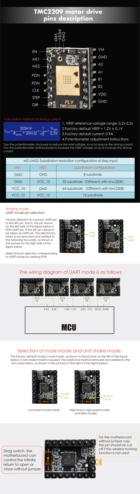
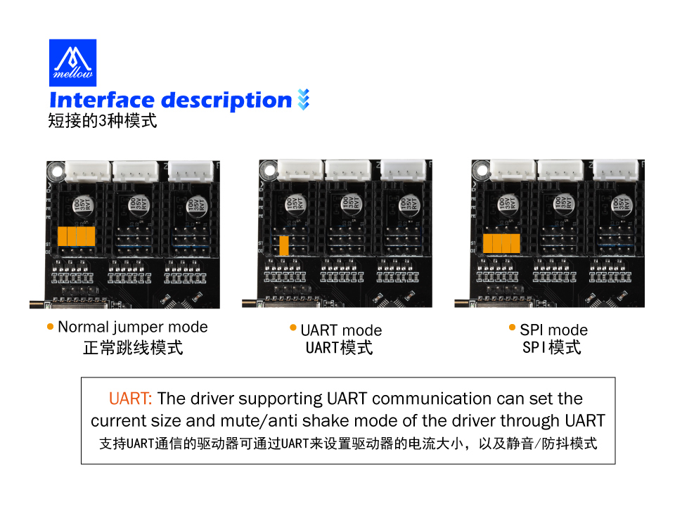

# TMC2209

### 1.  TMC-2209

* 输入电压 ：12V-24V
* 适用于 ： Marlin/Klipper/RRF 固件
* 电机不容易丢步
* 支持静音模型
* 大面积风扇热垫，降低驱动工作温度
* 驱动模式支持：TMC：UART
* 支持电机堵转检测



### 2. FLY主板跳线

> 2209使用UART模式

**UART模式。**最常见的使用这种模式的驱动有：TMC2208、TMC2209、TMC2226等。这类驱动芯片可以与主控进行UART异步串行通信，可以通过修改配置文件来设置驱动的细分、运行电流、静音模式等。




### 3. TMC-2209无限位配置

```
注意事项
fly-2209背面有拨码，需要拨到另外一边
需要修改的地方
[stepper_x]
endstop_pin: tmc2209_stepper_x:virtual_endstop      # 使用驱动当限位
homing_retract_dist: 0        # 后撤距离
#   回退不改0会导致归位失败
#--------------------------------------------------------------------
##  请确保驱动型号配置正确 (2208 or 2209)
[tmc2209 stepper_x]                 # X 驱动配置 -TMC2209

driver_sgthrs: ^!PF3                # 虚拟限位，原来的x限位

#   微控制器连接到TMC2209的DIAG接口的引脚
#   这个引脚通常使用"^"前缀来开启内部上拉
#   设置这个会创建一个名为"tmc2209_stepper_x:virtual_endstop"的虚拟引脚
#   用做步进电机的终止引脚。
#   在启动"sensorless homing"（无限位归零）时设置这个。
#   默认是关闭了无限位归零
driver_SGT: 100
#   （确保同时设置了driver_SGTHRS为一个合适的灵敏度）
#   灵敏度在80-120之间
```
