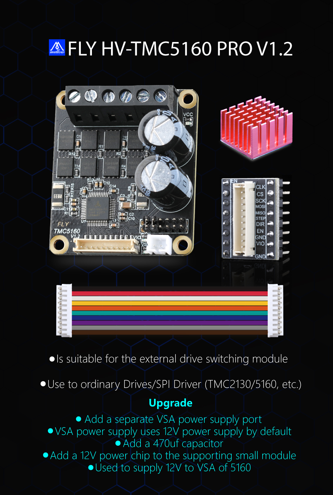
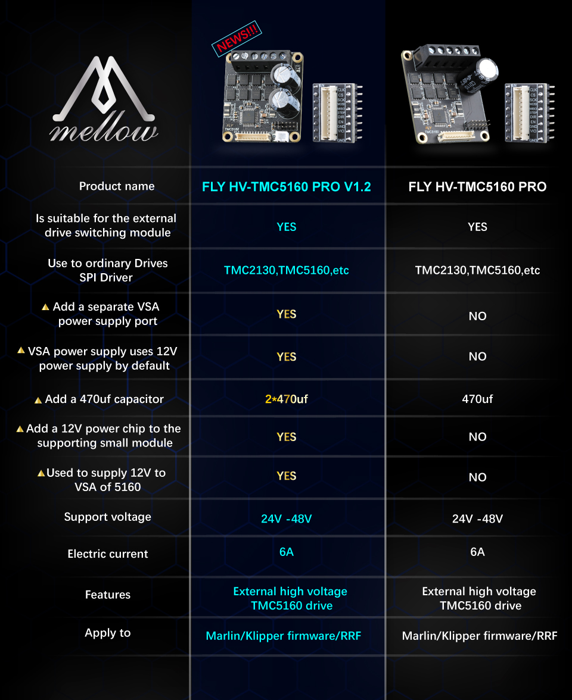
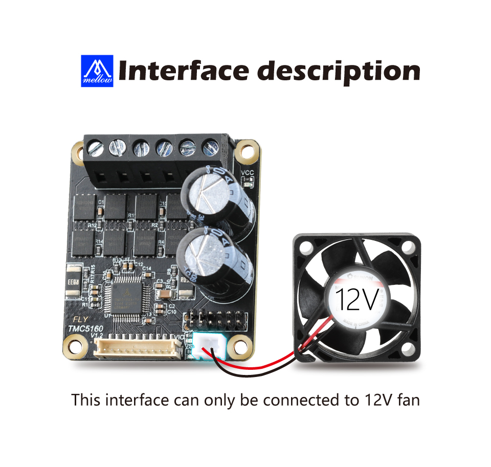

# TMC5160-PRO

### 1.  TMC5160-PRO

* 输入电压 ：24-48V
* 最大电流 ：6A
* 适用于 ： Marlin/Klipper/RRF 固件
* 驱动模式支持：TMC：SPI
* 带微步插值 microPlyer 的步进/方向接口
* 最高分辨率为256细分
* 支持stealthChop2静音工作和流畅动作
* 支持中频共振的共振抑制
* 支持spreadCycle高动态电机控制斩波器
* 支持dcStep负载相关的速度控制
* 支持stallGuard2高精度无传感器电机负载检测
* 支持coolStep电流控制，最高可节能75%

### 2. FLY主板跳线

> 5160PRO使用SPI模式

**SPI模式。**最常见的使用这种模式的驱动有：TMC5160、TMC2230等。这类驱动芯片通过spi与主控同步串行通信，同样的也可以通过修改配置文件来设置驱动的细分、运行电流、静音模式等。

### 3. TMC5160-PRO风扇

> TMC5160-PRO自带一个2pin风扇接口，只能接12V风扇

   
