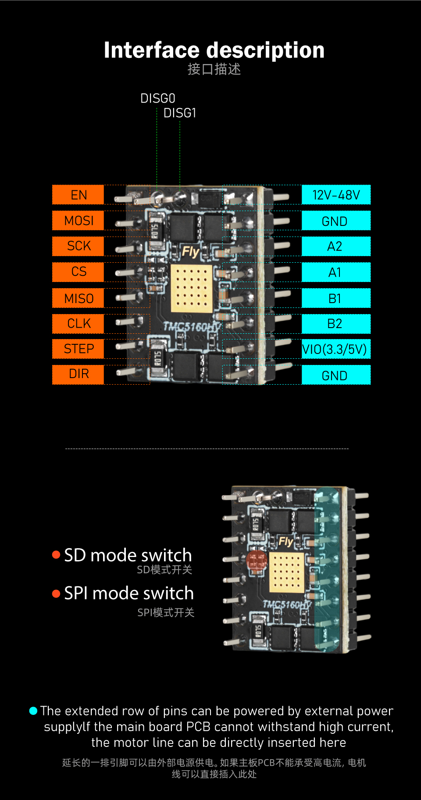

# TMC5160HV

?>**TMC5160HV支持12V-24V**

?>**采样电阻0.075**

### 1.  TMC-5160HV

* 输入电压 ：12V-48V
* 最大电流 ：4.4A
* 适用于 ： Marlin/Klipper/RRF 固件
* 驱动模式支持：TMC：SPI
* 带微步插值 microPlyer 的步进/方向接口
* 最高分辨率为256细分
* 支持stealthChop2静音工作和流畅动作
* 支持中频共振的共振抑制
* 支持spreadCycle高动态电机控制斩波器
* 支持dcStep负载相关的速度控制
* 支持stallGuard2高精度无传感器电机负载检测
* 支持coolStep电流控制，最高可节能75%




### 2. FLY主板跳线

> 5160HV使用SPI模式

**SPI模式。**最常见的使用这种模式的驱动有：TMC5160、TMC2230等。这类驱动芯片通过spi与主控同步串行通信，同样的也可以通过修改配置文件来设置驱动的细分、运行电流、静音模式等。


### 3. TMC-5160HV无限归位参考配置

?>**注意事项**

?>**5160HV采样电阻是0.075**

?>**fly-5160HV自带DIAG引脚用于无限位.如果不使用无限位需要剪去DIAG引脚**

```
[stepper_x]
endstop_pin: tmc5160_stepper_x:virtual_endstop      # 使用驱动当限位
homing_retract_dist: 0              # 后撤距离
#   回退不改0会导致归位失败
#--------------------------------------------------------------------
[tmc5160 stepper_x]                 # TMC5160

sense_resistor: 0.075               # 驱动采样电阻不要改
diag1_pin: ^!PF3                    # 虚拟限位

#   微控制器连接到TMC5160的DIAG接口的引脚
#   这个引脚通常使用"^"前缀来开启内部上拉
#   设置这个会创建一个名为"tmc5160_stepper_x:virtual_endstop"的虚拟引脚
#   用做步进电机的终止引脚。
#   在启动"sensorless homing"（无限位归零）时设置这个。
#   默认是关闭了无限位归零
driver_SGT: 1
#   灵敏度和皮带松紧有关需要自行调节
#  （确保同时设置了driver_SGTHRS为一个合适的灵敏度）


```


   
