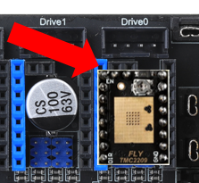

# 驱动使用

> ## **驱动有方向，请通电前检查是否有接反与跳线是否有安装到位**

## 1. 驱动的安装

驱动在安装前需要进行相应的检查，以免对驱动或主板造成损坏。

**FLY驱动：**如果不使用无限位归零功能，请将拨码开关拨到1的位置；相反如果要使用无限位归零功能，请将拨码开关拨到ON的位置。


**注意！！！ 安装驱动模块时，一定要保证插入的方向正确，即EN引脚在左上角，否则会损坏驱动甚至主板！！！注意给驱动贴好散热片！！！**



## 2.驱动模式选择

**STEP/DIR模式。**在这个模式下，通过使用跳线帽来设置细分，通过调节电位器来调整电流。最常见的是A4988驱动，使用这类驱动需要查询厂家提供的细分配置表，然后通过跳线帽来设置细分。

**UART模式。**最常见的使用这种模式的驱动有：TMC2208、TMC2209、TMC2226等。这类驱动芯片可以与主控进行UART异步串行通信，可以通过修改配置文件来设置驱动的细分、运行电流、静音模式等。

**SPI模式。**最常见的使用这种模式的驱动有：TMC5160、TMC2230等。这类驱动芯片通过spi与主控同步串行通信，同样的也可以通过修改配置文件来设置驱动的细分、运行电流、静音模式等。


## 3. 电机方向

> 5160与2209的电机线序相反，如果之前使用2209现在更换5160后需要反转相应配置里面的dir_pin:

```
#TMC-2209
[stepper_x]
step_pin: PE14                      # X轴电机脉冲引脚设置
dir_pin: PE15
#TMC-5160
[stepper_x]
step_pin: PE14                      # X轴电机脉冲引脚设置
dir_pin: !PE15 
```

