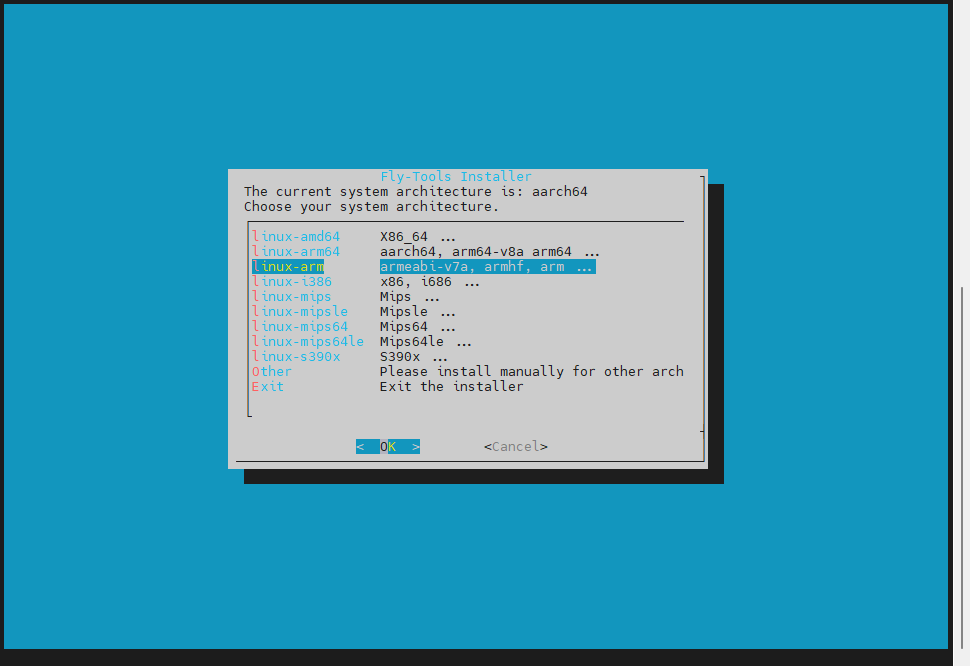

## 安装FLY-Tools

1. 拉取最新版本Klipper

   ```
   cd ~/klipper
   git pull
   ```

   - 如果您修改过本地klipper源码导致拉取失败，请使用以下命令。 （此操作将丢弃您之前修改过的文件）

   ```
   cd ~/klipper
   git checkout .
   git pull
   ```

2. 拉取最新的Katapult(原Canboot)

   ```
   cd ~/
   git clone https://github.com/Arksine/katapult
   ```

3. 安装Fly-Tools服务

   - 安装过程依赖Github服务，如果安装过程中长时间无响应，请按`Ctrl + C`退出安装脚本并重试

   ```
   curl -kfsSL https://raw.githubusercontent.com/kluoyun/FLY-Tools/main/scripts/install.sh | sudo bash
   ```

   <!-- tabs:start -->

   ### ****FLY-Gemini**,**FLY-π**,**FLY-C8**,**FLY-PI-v2**的安装选项**

   

   ### ****FLY-lite2**的安装选项**

   
   

<!-- tabs:end -->

1. 打开浏览器
   - 默认端口9999
   - `http://{你的设备IP}:9999/`