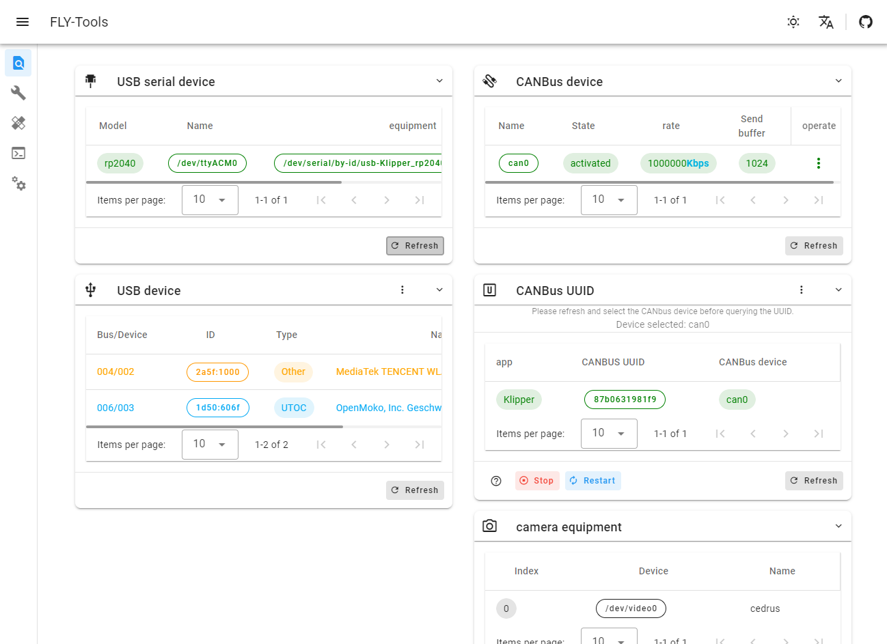
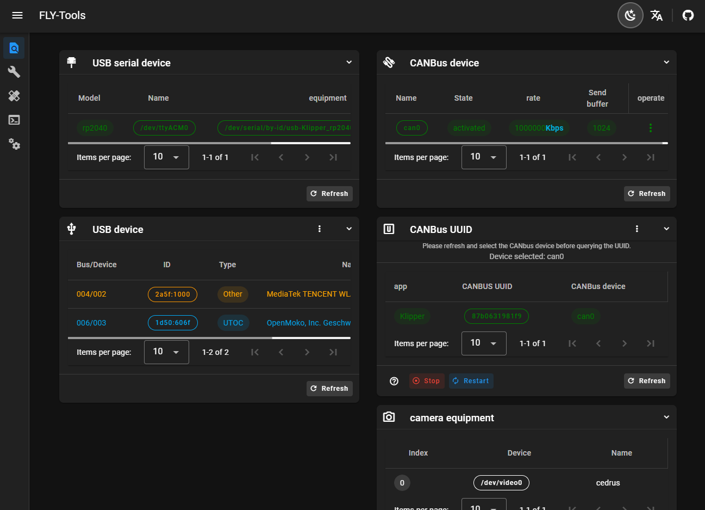

# 网页简介

FLY-Tools是广州镁伦电子科技有限公司针对Klipper所定制的WEB工具，可用于大部分安装了Klipper服务的上位机。

> [!TIP]
> **FLY-Tools仅适用于安装了klipper的Linux系统**

## FLY-Tools特点

* 多语言支持，暗色主题支持
* 支持查询并一键复制USB串口ID，USB设备ID，CANbus UUID，Video设备ID
* 支持一键启用或禁用指定是CAN设备
* 支持在线修改CAN设备的速率及发送缓冲区大小
* 支持在线编译FLY主板的klipper固件(Katapult固件编译正在适配)
* 支持在线烧录，支持DFU,HID,CAN等烧录方式
* 支持下载所有已编译的固件文件
* 支持在线生成Klipper负载图
* 支持一键自动测量并生成共振图
* 支持网页SSH连接
* 支持WEB网页SSH(基于[ttyd](https://github.com/tsl0922/ttyd))

## 网页图片

