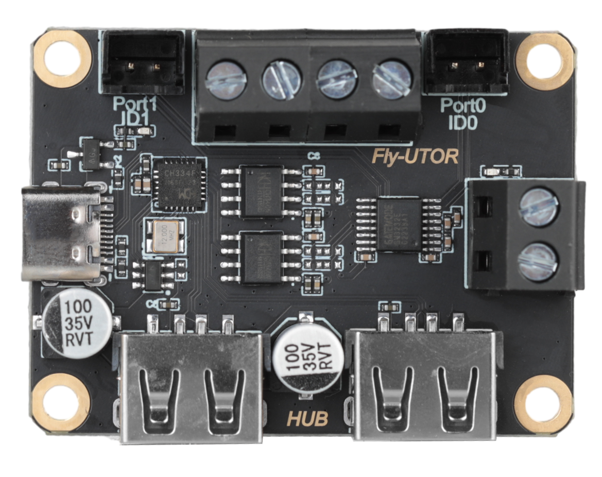

# FLY-UTOR

FLY-UTOR是一款高性能、多用途的接口扩展解决方案，旨在为用户提供额外的USB接口和电源扩展能力，同时支持UART转RS232通信。该扩展板设计紧凑，易于安装，适用于需要额外接口和电源输出的各种应用场景。

## 产品特性

* 双USB口扩展：扩展板提供两个额外的USB接口，支持USB 2.0标准，确保与各种USB设备的兼容性和高速数据传输。
* UART转RS232支持：内置UART转RS232转换器，方便用户将串行设备接入系统，扩展设备的通信能力。
* 双电源接口扩展：提供两个电源接口，允许用户同时扩展两个外部电源，满足额外电源需求。
* 稳定电源设计：扩展板设计有稳定的电源电路，确保连接设备的稳定运行。
* 易于安装：采用标准尺寸设计，适用于多种环境，无需额外驱动安装。
* 紧凑尺寸：扩展板尺寸合理，不会占用过多空间，方便集成到各种项目中。

## 产品规格：

- 可用接口：USB X2，UART转RS232 X2 ，电源接口 X2
- 电源接口：12V/24扩展
- 兼容性：带USB接口的上位机

## 注意事项：

- 安装前断开电源并关闭所有设备。
- 将多功能USB扩展板插入主板USB口或其他USB扩展接口中。
- 连接所需的USB设备和/或电源到扩展板。
- 如需使用UART转RS232功能，连接相应的串行设备。
- 重新连接电源，并启动设备。
- 系统应自动检测到扩展板并进行配置。如有必要，请参考操作后面配置注意事项
