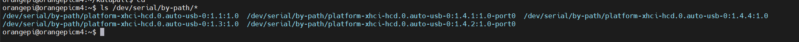

# **搜索id**

```
ls /dev/serial/by-path/*
```



# 参考配置

```
[mcu SB2040V3]  # 工具主板序列号
## RS232 ID
## 请根据固件配置填写波特率
serial: /dev/serial/by-path/platform-xhci-hcd.0.auto-usb-0:1.4.2:1.0-port0
baud: 250000
restart_method:command
```

